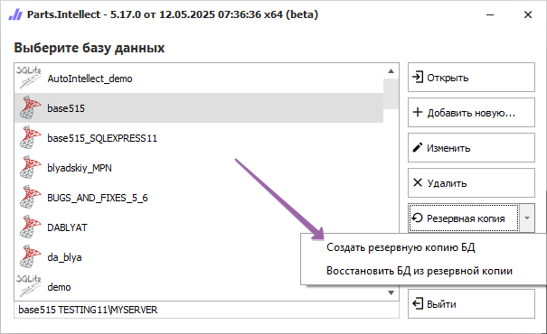
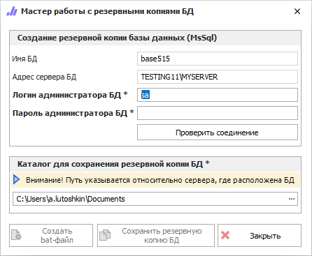

**»** В стартовом окне нажмите команду **Создать резервную копию БД**.

**»** После выполнения команды откроется окно **Мастера работы с резервными копиями БД**.

Окно содержит:

- блок **Создание резервной копии баз данных (MsSql)** – позволяет указать данные, необходимые для создания резервной копии базы данных:

    - **Имя БД** – наименование базы данных;

    - **Адрес сервера БД** – IP-адреса устройства, на котором установлен сервер базы данных;

    - **Логин администратора БД** – логин учетной записи администратора базы данных, для подключения к ней;

    - **Пароль администратора БД** – пароль от учетной записи администратора базы данных, для подключения к ней;

    ::: warning Внимание!

    Логин и пароль администратора SQL Сервера хранятся в открытом виде.

    :::

    - кнопка **Проверить соединение** – позволяет осуществить проверочное соединение к базе данных.

- блок **Каталог для сохранения резервной копии БД** – позволяет указать путь по которому будет сохраняться резервная копия базы данных при ручном и автоматическом сохранении.

::: info Примечание

Каталог для сохранения резервной копии БД указывается относительно компьютера, где расположен SQL-сервер. Каталог "С:User\\_\_\Documents" должен быть расположен на данном компьютере, вне зависимости от того, с какого компьютера запущена процедура создания резервной копии. Файл с резервной копией БД будет расположен в указанном каталоге компьютера, на котором расположен SQL-сервер.

:::

- кнопка  **Создать bat-файл** – позволяет создать bat-файл при запуске которого будет создаваться резервная копия базы данных.

::: note Замечание

При запуске bat-файла открывается программа и SQL-серверу передается запрос о необходимости создать резервную копию БД и поместить ее в требуемый каталог (с соответствующим именем резервной копии). 

:::

- кнопка  **Сохранить резервную копию БД** – позволяет вручную сохранить резервную копию базы данных. Для БД версии MS SQL процесс создания резервной копии осуществляется средствами самого SQL Сервера (**Parts.Intellect** лишь передает SQL-серверу требуемую для создания резервной копии информацию). При этом для имени файла резервной копии применяется следующая маска: "**ГГГГ-ММ-ДД чч-мм-сс ИМЯ\_БД.bak**". Например, "2012-04-09 15-37-11 test01\_3\_04.bak", т.е. по имени файла всегда можно определить, когда и для какой БД была создана резервная копия.

- кнопка  **Закрыть** – позволяет закрыть окно **Мастера работы с резервными копиями БД**.