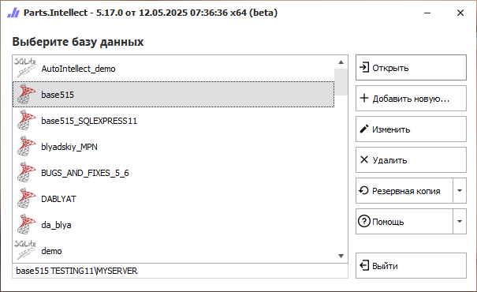
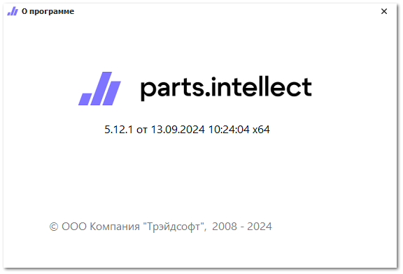

Запустить программу можно с ярлыка на рабочем столе **Parts.Intellect**, либо через меню **Пуск** в поиске **Запустить Parts.Intellect**. Откроется **Стартовое окно** программы.

Стартовое окно содержит следующие элементы:

- список баз данных – позволяет выбрать базу данных доступных для подключению, удаления, редактирования и создания резервной копии;

- кнопка  **Открыть** – позволяет осуществить подключение и вход в выбранную базу данных;

- кнопка  **Добавить новую** – позволяет запустить **Мастер создания новой базы данных**;

- кнопка  **Изменить** – позволяет изменить параметры текущего подключения к базе данных.

- кнопка  **Удалить** – Позволяет удалить строку подключения к базе данных.

::: info Примечание

Кнопка **Удалить** выполняет удаление только строки подключения к базе из списка. При этом сама база данных не удаляется.

:::

- кнопка  **Резервная копия** – позволяет создавать резервные копии баз данных и восстанавливать из резервных копий.

- кнопка  **Помощь** – позволяет открыт справочную информацию по программе:

    - **Руководство** – раздел служит для открытия файла руководства пользователя к программе;

    - **Написать в службу поддержки** – быстрый переход в онлайн чат со специалистом технической поддержки;

    - **Проверить обновления** – программа проверяет наличие актуальных обновлений на сайте [tradesoft.ru](https://www.tradesoft.ru/personal/my-products/);

    - **О программе** – пункт содержит информацию о программе и ее версии.

- кнопка  **Выйти** – позволяет выйти из программы.

::: note Замечание

По умолчанию в системе уже создана и подключена демонстрационная база данных версии SQLite с заполненными справочниками, прайс-листами и документами для более удобного знакомства пользователей с программой в течении пробного периода.

:::