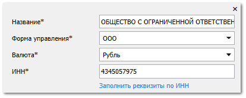
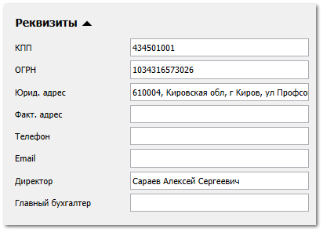
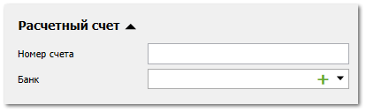
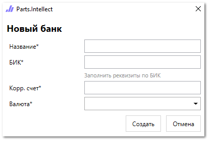
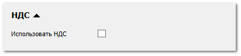
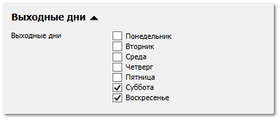

**»** Перейдите в раздел **Помощь ► Мастер первичной настройки**, вкладка **Наши фирмы**.

**»** Заполните поле **ИНН**.

**»** Нажмите команду **Заполнить реквизиты по ИНН**. Поля **Название** и **Форма управления** автоматически заполнятся.

**»** В поле **Валюта** выберите валюту, в которой работает ваша организация.

**»** Заполните оставшиеся реквизиты при необходимости.

**»** Заполните поле **Номер счета** вашей организации для принятия безналичных оплат в блоке **Расчетный счет**.

**»** В поле **Банк** нажмите кнопку . Откроется форма создания банка.

**»** Заполните поле **БИК**.

**»** Нажмите команду **Заполнить реквизиты по БИК**. Поля **Название** и **Корр. счет** автоматически заполнятся.

**»** Выберите валюту в поле **Валюта**.

**»** Нажмите **Создать**. В поле **Банк** автоматически добавится значение банка-контрагента.

**»** Включите опцию **Использовать НДС** при необходимости.

**»** В блоке **Выходные дни** установите отметки выходных дней вашей организации.

**»** Нажмите кнопку **Сохранить**. 

::: note Замечание

В разделе **Управление ► Настройки программы**, вкладка **Наши фирмы** добавится запись.

В разделе **CRM ► Клиенты**, группа **(Наши фирмы)** добавится карточка.

При добавлении **Нашей фирмы** с заполненным блоком **Расчетный счет** в разделе **Финансы ► Счета и кассы** добавится запись счета для принятия безналичной оплаты. 

:::