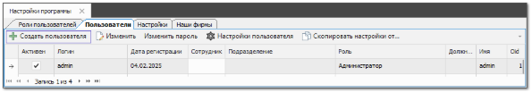
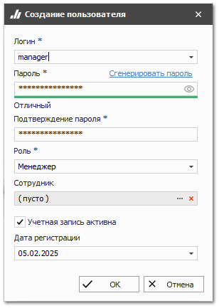

При создании базы данных создается только один пользователь с ролью **Администратор**.

::: warning Внимание!

НЕ рекомендуется работать под пользователем с ролью **Администратор**.Рекомендуется создать дополнительных пользователей и работать исключительно под ними!

:::

Для создания других пользователей базы данных выполните следующие действия:

**»** Перейдите в раздел **Управление ► Настройки программы**, вкладка **Пользователи**.

**»** Нажмите кнопку **Создать пользователя** на панели инструментов. Возникнут элементы для добавления нового пользователя.

**»** В появившемся окне заполните поля **Логин** и **Пароль**.

::: warning Внимание!

Обязательно сохраните сгенерированный пароль.

:::

::: info Примечание

Для генерации случайного пароля воспользуйтесь кнопкой **Сгенерировать пароль**, автоматически сформируется 15-20 символьный пароль и подставится в поля **Пароль** и **Подтверждение пароля**, также он будет скопирован в буфер обмена.

:::

**»** В поле **Подтверждение пароля** повторно введите пароль.

::: note Замечание

Также, в момент подачи запроса на сохранение данных, происходит проверка сложности введенного пароля. Критерии оценки пароля:
- количество используемых символов;
- типы используемых символов: заглавные и строчные латинские буквы, цифры, спецсимволы.

Оценка стойкости пароля:
- **Слабый** – количество символов не менее 1;
- **Средний** – количество символов не менее 8, используется не менее 2х различных типов символов;
- **Стойкий** – количество символов не менее 8, используется не менее 3х различных типов символов.

:::

**»** В поле **Роль** выберите роль пользователя.

::: note Замечание

Роль пользователя определяет доступные разделы и разрешения в программе. В дальнейшем для выбранной роли пользователя вы можете задать настройки и разрешения.

:::

**»** Установите отметку в поле **Учетная запись активна**.

**»** Нажмите кнопку **Ок**.

::: note Замечание

Выбор сотрудника, привязанного к пользователю является необязательным этапом. Карточка сотрудника содержит расширенный набор сведений о сотруднике (паспортные данные, реквизиты и т.д.), а также адрес электронной почты, на которую будут приходить уведомления по настроенным событиям.

:::