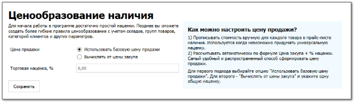

**»** Перейдите в раздел **Помощь ► Мастер первичной настройки**, вкладка **Ценообразование наличия**.

::: warning Внимание!

Вкладка **Ценообразование наличия** доступна, если создана хотя бы одна запись на вкладках [**Наши фирмы**](./dobavlenie_kartochki_vashej_firmy.md) и [**Торговые точки и склады**](./dobavlenie_torgovoj_tochki_i_sklada.md) 

:::

**»** В опции **Цена продажи** выберите режим ценообразования.

**»** В поле **Торговая наценка, %** установите наценку, если в опции **Цена продажи** выбрали значение **Вычислять от цены закупа**.

**»** Нажмите команду **Сохранить**.** 

::: note Замечание

В разделе **Товары и цены** **► Прайс-лист наличия**, вкладка **Ценообразования** добавится запись.

:::