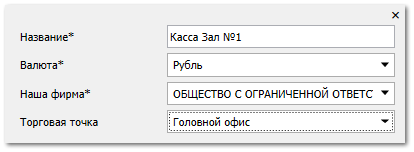
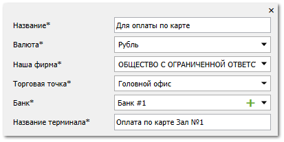
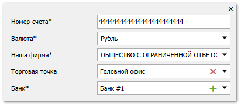

**»** Перейдите в раздел **Помощь ► Мастер первичной настройки**, вкладка **Счета и кассы**.

::: warning Внимание!

Вкладка **Счета и кассы** доступна, если создана хотя бы одна запись на вкладках [**Наши фирмы**](./dobavlenie_kartochki_vashej_firmy.md) и [**Торговые точки и склады**](./dobavlenie_torgovoj_tochki_i_sklada.md) 

:::

**»** Нажмите команду **Добавить кассу** в блоке **Оплаты наличными**:

- **Название** – введите понятное для вас название кассы;

- **Валюта** – выберите валюту, с которой работает касса;

- **Наша фирма** – выберите **Нашу фирму**, которой принадлежит касса;

- **Торговая точка** – выберите торговую точку, на которой находится касса.

   

**»** Нажмите команду **Добавить счет** в блоке **Оплаты по карте**:

- **Название** – введите понятное для вас название счета;

- **Валюта** – выберите валюту счета;

- **Наша фирма** – выберите **Нашу фирму**, которой принадлежит терминал;

- **Торговая точка** – выберите торговую точку, на которой располагается терминал для принятия оплаты по карте;

- **Банк** – выберите банк, через который работает терминал, либо нажмите кнопку ![ref11] для создания нового банка;

- **Название терминала** – введите понятное для вас название терминала.

**»** Нажмите команду **Добавить счет** в блоке **Оплаты на безналичный счет**:

::: note Замечание

Если вы заполняли блок **Расчетный счет** на вкладке [**Наши фирмы**](#3001121b-4890-48a8-a5d1-91eeb221876c), то в блоке **Оплаты на безналичный расчет** отобразится добавленный ранее счет.

:::

- **Номер счета** – введите номер расчетного счета вашей организации;

- **Валюта** – выберите валюту счета;

- **Наша фирма** – выберите **Нашу фирму**, которой принадлежит расчетный счет;

- **Торговая точка** – выберите торговую точку расчетного счета;

- **Банк** – выберите банк счета, либо нажмите кнопку  для создания нового банка.

   

**»** Нажмите команду **Сохранить**. 

::: note Замечание

При создании счетов в разделе **Финансы ► Счета и кассы** добавятся записи счетов.

При создании счетов в блоках **Оплаты наличными** и **Оплаты на безналичный счёт** в разделе **Финансы ► Счета и кассы ► Настроить счета НФ по умолчанию** сформируются по 2 правила **Тип платежа** – значение **ПП** / **ППвх** и **ПКО** / **РКО**.

При создании счета в блоке **Оплаты по картам** в разделе **Управление ► Торговое оборудование ► Справочник торгового оборудования**, вкладке **Эквайринг** добавится запись **Тип устройства** – **Не интегрированный**.

:::