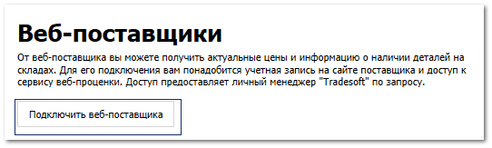
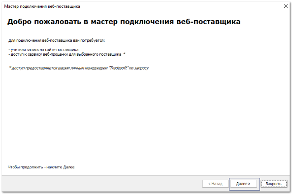
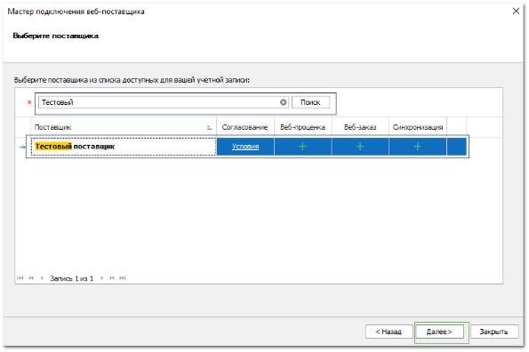
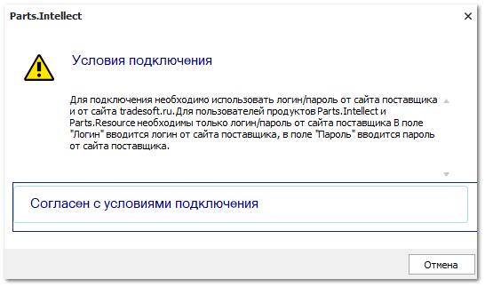
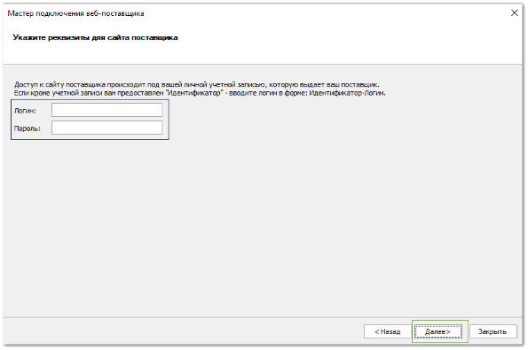
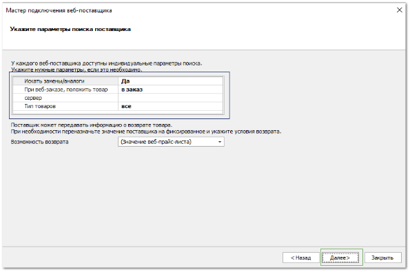
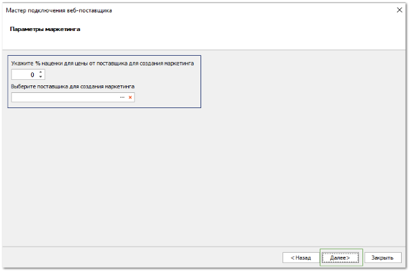
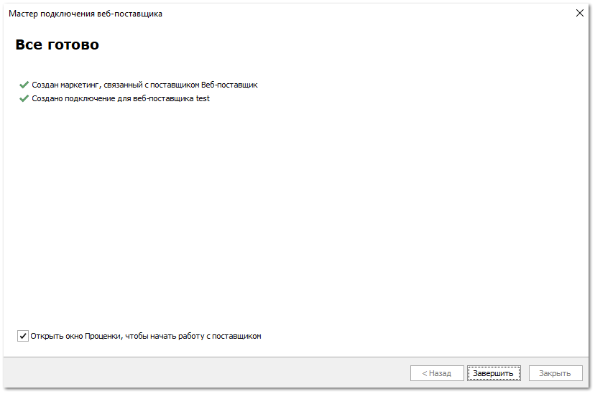

# Добавление веб-поставщика

**»** Перейдите в раздел **Помощь ► Мастер первичной настройки**, вкладка **Веб-поставщики**.

::: info Примечание

Для работы сервиса **Веб-проценка** необходимо подключение дополнительной услуги. Условия подключения вы можете узнать в [отделе продаж](www.tradesoft.ru/about/contacts).Предварительно свяжитесь с веб-поставщиком, прайс-лист которого вы хотите получить. Запросите у него **логин** и **пароль** для подключения.

:::
::: warning Внимание!

Вкладка **Веб-поставщики** доступна, если создана хотя бы одна запись на вкладках [**Наши фирмы**](./dobavlenie_kartochki_vashej_firmy.md) и [**Торговые точки и склады**](./dobavlenie_torgovoj_tochki_i_sklada.md)

:::

**»** Нажмите команду **Подключить веб-поставщика**. Откроется мастер подключения веб-поставщика

**»** Нажмите команду **Далее**. Откроется шаг выбора поставщика.

**»** В поле поиска введите наименование необходимого веб-поставщика.

**»** Выделите нужного веб-поставщика

**»** Нажмите команду **Далее**. Откроется окно с условиями подключения веб-поставщика.

::: warning Внимание!

Обязательно ознакомьтесь с условиями подключения перед соглашением.

:::

**»** Нажмите команду **Согласен с условиями подключениями**, если вы согласны с условиями веб-поставщика. Откроется окно ввода логина и пароля для подключения.

**»** Введите **Логин** и **Пароль** для подключения к веб-поставщику. Если у вас нет логина и пароля для подключения, то запросите их у веб-поставщика.

**»** Нажмите команду **Далее**. Откроется окно настройки параметров поиска.

**»** Задайте параметры поиска по прайс-листу веб-поставщика:

::: note Замечание

У разных веб-поставщиков возможны различные параметры поиска.

:::

**»** Нажмите команду **Далее**. Откроется окно настройки параметров маркетинга.

**»** Укажите значение наценки в поле **Укажите % наценки для цены от поставщика для создания маркетинга**.

**»** Выберите поставщика в поле **Выберите поставщика для создания маркетинга**.

**»** Нажмите команду **Далее**. Откроется окно, уведомляющее об успешности подключения веб-поставщика.

**»** Отключите опцию в поле **Открыть окно Проценки, чтобы начать работу с поставщиком**, если не требуется переходить к работе с проценкой и нажмите команду **Завершить**.