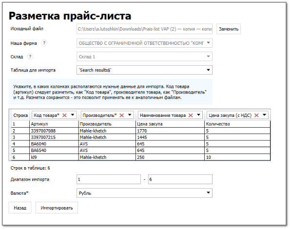
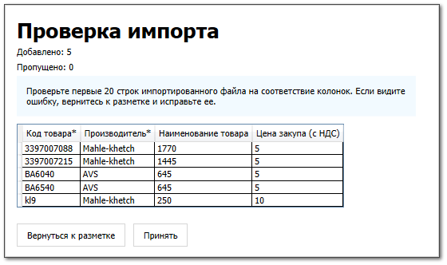

**»** Перейдите в раздел **Помощь ► Мастер первичной настройки**, вкладка **Прайс-лист наличия**.

::: warning Внимание!

Вкладка **Прайс-лист наличия** доступна, если создана хотя бы одна запись на вкладках [**Наши фирмы**](./dobavlenie_kartochki_vashej_firmy.md) и [**Торговые точки и склады**](./dobavlenie_torgovoj_tochki_i_sklada.md) 

:::

::: note Замечание

Нажмите команду **Скачать пример** в поле подсказки, если у вас нет готового прайс-листа. Подготовьте файл прайс-листа в соответствии с примером.

:::

**»** В поле **Наша фирма** выберите **Нашу фирму**, которая будет указана в документе **Приходная накладная**.

**»** В поле **Склад** выберите склад, на который приходуется товар.

**»** Нажмите **Загрузить файл** и выберите файл для импорта. Откроется страница **Разметка прайс-листа**.

**»** В поле **Таблица для импорта** выберите необходимую таблицу, если в вашей файле их несколько.

**»** Разметьте колонки **Код товара** и **Производитель**.

**»** Разметьте дополнительные колонки при необходимости.

**»** В поле **Диапазон импорта** укажите, с какой по какую строку необходимо импортировать документ.

**»** В поле **Валюта** выберите валюту импортируемых позиций.

**»** Нажмите команду **Импортировать**. Откроется окно **Проверка импорта**.

::: warning Внимание!

Большие файлы импортируются дольше обычного. Рекомендуем не закрывать вкладку во время импорта!

:::

**»** Проверьте правильность размеченных колонок.

**»** Нажмите команду **Принять**.

::: note Замечание

В разделе **Склад и закупки ► Приходные накладные** добавится и проведется документ **Приходная накладная** с импортируемыми позициями. В раздел **Товары и цены ► Прайс-лист** **наличия** отобразятся оприходованные позиции.

:::