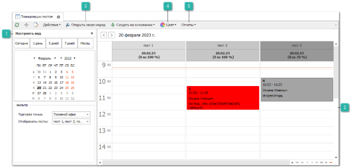
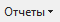

Инструмент **Планировщик постов** предназначен для управления загруженностью постов **Заданиями в ремзону**. Инструмент поддерживает одновременную работу нескольких пользователей с обновлением информации в реальном масштабе времени (только СУБД MS SQL). Например, в ремзоне можно повесить телевизор, на который выводить окно планировщика из Parts.Intellect на текущий день. Тем самым работники смогут в реальном времени видеть планируемую загрузку своих постов.

 **Настроить вид**

Настройка вида позволяет установить период отображения рабочей области планировщика, в зависимости от поставленной задачи, для отображения доступны:

- Сегодня;

- 1 день;

- 5 дней;

- 7 дней;

- Месяц;

- Выбрать необходимые даты в календаре.

::: note Заметка

По умолчанию отображается текущий день.

:::
Фильтры позволяют выбрать необходимую для планирования загрузки **Торговую точку** и **Посты** в ней.

 **Область управления заданиями**

Рабочая область содержит задания в ремзону, расположенные под постами во временной сетке. Временная сетка имеет шаг от 5 до 60 минут. 

::: note Заметка

Для изменения шага временной сетки достаточно покрутить скролом мышки с зажатой кнопкой "CTRL", либо вызвать контекстное меню на обозначении шкалы времени.

:::
Для создания заданий достаточно выделить требуемое количество ячеек времени и в контекстном меню воспользоваться командой **Новое**.

При этом с уже созданными заданиями можно выполнять следующие действия:

- перемещать задание как внутри поста, так и между постами;

- изменять время исполнения задания, перемещая верхнюю или нижнюю границу элемента;

- копировать задания, перемещая их с зажатой кнопкой "CTRL";

- создавать на основании заданий документ **Заказ-наряд**. Команда расположена в контекстном меню элемента с заданием;

- открывать **Заказ-наряды**, привязанные к заданиям, с помощью команды **Открыть Заказ-наряд**.

Панель действий содержит стандартные команды и некоторые уникальные команды:

 **Открыть заказ-наряд**

Позволяет открыть документ **Заказ-наряд**, на основании которого было создано **Задание в ремзону**.

 **Цвет**

Позволяет выделить необходимым цветом **Задания в ремзону** в планировщике постов.

 **Отчеты**

Позволяет создать **Отчет – Загруженности** постов за указанный период времени.

