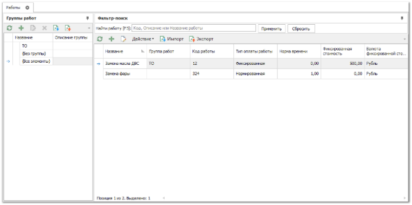

Справочник **Работы** служит для хранения перечня услуг и работ, оказываемых автосервисом. В него входит классификатор (**Группы работ**), который наполняется карточками конкретных работ с нормой времени или фиксированной ценой. У работ указываются название, код, тип: фиксированная или нормированная, а также коэффициенты сложности/квалификации и исполнители по умолчанию. 

