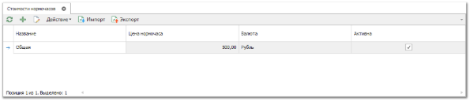

Справочник **Стоимости нормочаса** используется для хранения фиксированных тарифов на стоимость нормочаса работы в зависимости от принятых в компании стандартов. В дальнейшем тарифы из справочника используются при наполнении **Заказ-наряда** нормированными работами, для вычисления итоговой стоимости работы.

В записи справочника указывается наименование, стоимость нормочаса работы в выбранной валюте, а также признак **Активности**, который указывает на возможность использования текущей стоимости нормочаса в новых документах **Заказ-наряд**.

