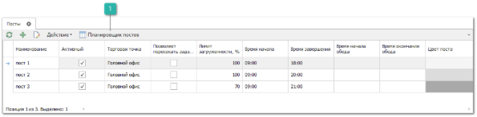
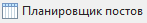

Справочник **Посты** предназначен для заполнения постов ремонтных зон автопредприятия. В **Планировщике постов** осуществляется управление загруженностью постов заданиями.

Для каждой торговой точки допускается добавление неограниченного количества постов ремонтной зоны. Так же допускается на разных **Торговых точках** создавать **Посты** с одинаковым именем.

Панель действий содержит стандартные команды и некоторые уникальные команды:

 **Планировщик постов**

Позволяет открыть **Планировщик постов**.

