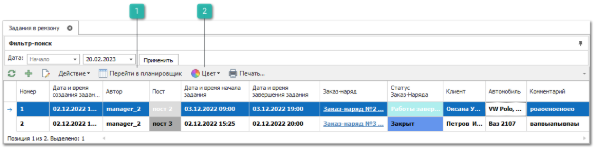
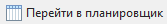

Пункт меню содержит список документов **Задание в ремзону**, который предназначен для учета работ в ремонтной зоне автопредприятия.

Панель действий содержит стандартные команды и некоторые уникальные команды:

 **Перейти в планировщик**

Позволяет открыть **Планировщик постов**.

 **Цвет**

Позволяет выделить необходимым цветом **Задания в ремзону** в планировщике постов.

