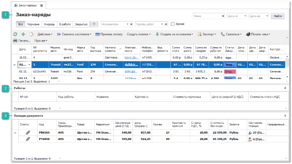

Пункт меню содержит список документов **Заказ-наряд**, который служит для фиксации выполненных работ и установленных в автомобили клиентов запчастей.

 **Заказ-наряды**

В табличной части отображены созданные документы **Заказ-наряд**;

 **Работы**

В табличной части отображены работы по выбранному **Заказ-наряду**;

 **Позиции документа**

В табличной части отображены позиции товаров по выбранному **Заказ-наряду**.

::: info Примечание

Создание документа **Заказ-наряд** возможно, как с помощью команды **Новый**, так и на основании документа **Заказ клиента** (передаются позиции из наличия, зарезервированные за клиентом и позиции в состоянии **Заказ клиента** или **Заказ поставщику**).

:::

