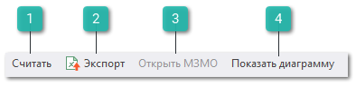

На панели инструментов инспектора **ABC-анализа** доступны следующие действия:

 **Считать**

Позволяет сформировать отчет с учетом заданных параметров.

 **Экспорт**

Позволяет сформировать файл в формате **.xls** и **.xlsx**.

 **Открыть МЗМО**

Позволяет открыть **Мастер заказов на склад** по выбранным позициям.

 **Показать диаграмму**

Позволяет сформировать диаграмму по отчету.