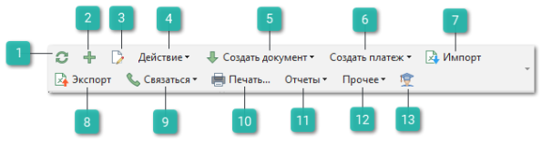
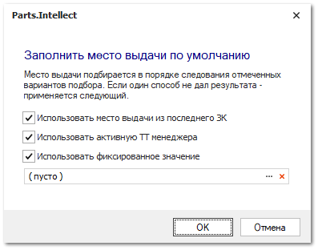
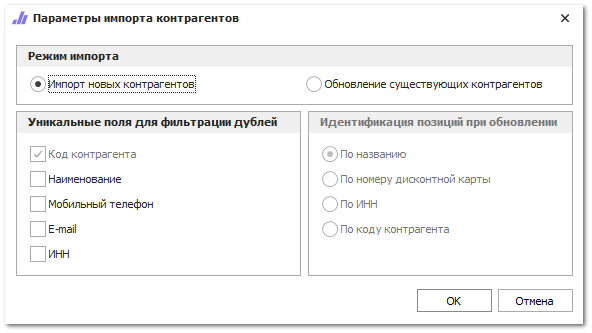
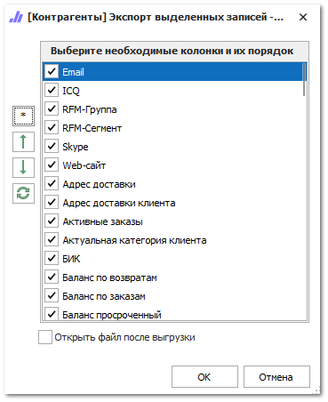
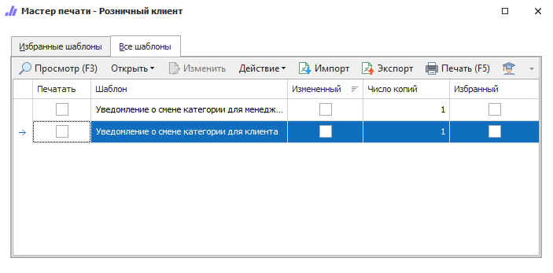
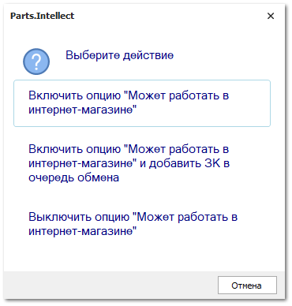

На панели инструментов справочника доступны следующие действия:

1. **Обновить**

    

    Позволяет обновить список контрагентов. Рекомендуется использоваться после внесения массовых изменений.

2. **Новый**

    

    Позволяет открыть окно инспектора для добавления нового контрагента.

3. **Редактировать**

    

    Позволяет открыть окно инспектора для редактирования контрагента.

4. **Действие**

    

    Содержит выпадающий список команд:

    - **Удалить** – позволяет удалить контрагента;

    ::: note Замечание

    При удалении контрагента с помощью кнопки **Удалить**, производится проверка наличия оформленных на него документов. Если документы будут найдены, то удаление записи о клиенте будет заблокировано.

    :::

    - **Копировать** – позволяет создать новую карточку контрагента, скопировав данные выделенного;

    - **Изменить блокировку** – позволяет установить/снять блокировку клиента;

    - **Обновить реквизиты** – позволяет автоматически заполненить/обновить реквизиты в карточках клиентов по ИНН и БИК. Поиск контрагентов по ИНН и БИК осуществляется на сервисе DaData.

    ::: warning Внимание!

    Для работы автоматического заполнения/обновления реквизитов по ИНН необходимо заполнить **API-ключ** из сервиса DaData в разделе **Управление ► Настройки программы ► Настройки**, группа настроек **CRM ► Контрагенты**. По умолчанию в программу встроен стандартный API-ключ, по которому доступно 10 000 запросов в день на всех клиентов, у который указан данный ключ. Вы можете зарегистрироваться на сайте сервиса DaData и ввести собственный API-ключ.

    :::
    ::: note Замечание

    Обновление реквизитов по **БИК** доступно только для контрагентов типа **Банк**.

    :::

    - **Изменить место выдачи...** – позволяет вызвать диалоговое окно для быстрого заполнения места выдачи клиентов;

    

    - **Изменить тип категории** – позволяет вызвать диалоговое окно для быстрой смены типа и категории клиента;

    - **Открыть мастер слияния контрагентов** – позволяет запустить диалоговое окно мастера слияния карточек контрагентов.

5. **Создать документ**

    

    Содержит выпадающий список команд для формирования следующих документов:

    - **Заказ клиента** – позволяет сформировать документ **Заказ клиента**;

    - **Расходная накладная** – позволяет сформировать документ **Расходная накладная**;

    - **Расходная накладная (мастер)** – позволяет открыть **Мастер создания расходной накладной** по выбранному клиенту;

    - **Заказ поставщику** – позволяет сформировать документ **Заказ поставщику**;

    - **Приход от поставщика** – позволяет сформировать документ **Приход от поставщика**;

    - **Открыть товары, готовые к заказу поставщику** – позволяет открыть **Мастер создания заказа поставщику**.

    ::: note Замечание

    Для разных типов контрагентов доступны разные документы для создания.

    :::

6. **Создать платеж**

    

    Содержит выпадающий список команд для формирования платежных документов:

    - **Приходный кассовый ордер**;

    - **Платежное поручение входящее**;

    - **Оплата по банковской карте**;

    - **Расходный кассовый ордер**;

    - **Платежное поручение исходящее**;

    - **Возврат по банковской карте**.

7. **Импорт**

    

    Позволяет открыть окно параметров импорта контрагентов.

    

    ::: note Замечание

    Системой поддерживаются следующие форматы файлов для загрузки:Microsoft Excel 95-2003 (\*.xls);
    Microsoft Excel 2007-2013 (\*.xlsx, \*.xlsm);
    Файлы dBase (\*.dbf);
    Текстовые файлы с разделителями "точка с запятой", "запятая", "табуляция" (\*.txt, \*.csv).

    :::

8. **Экспорт**

    

    Позволяет открыть окно для выделения колонок для экспорта

    

    ::: note Замечание

    Системой поддерживаются следующие форматы выгружаемых файлов:Файлы \*.csv с разделителями "точка с запятой", "табуляция".
    Microsoft Excel 2007 (\*.xlsx);
    Таблица XML 2003 (\*.xml);
    MS Access (\*.mdb).

    :::

9. **Связаться**

    

    Содержит выпадающий список команд:

    **Позвонить** – позволяет осуществить звонок на номер телефона контрагента. Для работы команды необходимо наличие дополнительного модуля IP-телефонии и подключенного поставщика телефонии;

    ::: info Примечание

    Команда доступна для пользователей с подключенной IP-телефонией. Для подключения телефонии свяжитесь с менеджерами компании Tradesoft.

    :::

    **Отправить сообщение** – позволяет отправить SMS-сообщения выбранным клиентам на номер телефона, указанный в их карточках. По нажатию на команду открывается форма для ввода текста сообщения;

    **Отправить email** – позволяет отправить письмо на email выбранным клиентам. Отправка выполняется на адрес **Электронной почты**, указанный в карточке контрагента. Настройки отправки email расположены в разделе [Уведомления. Электронная почта](#9e7fac5d-a49c-4055-be58-ea90575927c4)**.**

    ::: note Замечание

    Для работы сервисов отправки сообщений по email и SMS необходимо активировать соответствующие разрешения в разделе Управление **► Настройки программы ► Настройки ►** группа **CRM ► Уведомления**.

    :::

    **Открыть чат** – позволяет открыть чат на основе Telegram-бота с выбранным клиентом, если клиент подписан на Telegram-бота. Для работы команды необходимо наличие подключенного сервиса отправки уведомлений и сообщений через Telegram-бота и установленных настроек Telegram-бота в разделе [Чат с клиентом](#a874770c-98ba-4ecf-9035-4b94e1fbb0a3);

    ::: info Примечание

    Для работы сервиса отправки уведомлений и сообщений через Telegram-бота необходимо:

    - подключение дополнительной услуги. За подключением услуги обратитесь в отдел продаж Компании Tradesoft;

    - созданный и настроенный Telegram-бот;

    - установленный и подключенный Сервер Parts.Intellect. Подробнее в разделе [Установка Сервера Parts.Intellect](../../../work/server/ustanovka_servera.md).

    Подробнее о работе модуля читайте в [руководстве пользователя](https://product-doc.tradesoft.ru/ai/telegram/index.htm).

    :::

10. **Печать...**

    

    Позволяет открыть окно **Мастер печати**, в котором содержатся шаблоны документов, доступных для печати.

    

11. **Отчеты**

    

    Содержит выпадающий список команд для формирования отчетов:

    - **Движение денег**;

    - **Детализация балансов**;

    - **Обороты по контрагенту**;

    - **Дебиторская задолженность**.

    Каждая из команд позволяет открыть окно с доступными шаблонами по выбранному отчету.

12. **Прочее**

    

    Содержит выпадающий список команд:

    - **Разнести денежные средства** – позволяет автоматически разнести денежные средства выбранных контрагентов на документы **Расходные** и **Приходные накладные**; 

    - **Пересчитать балансы –** позволяет запустить пересчет балансов выделенных контрагентов;

    - **Пересчитать категорию клиента** – позволяет запустить принудительный пересчет динамической категории клиента при настроенной **Накопительной системе скидок** в программе;

    - **Показать/скрыть изображения** –** позволяет открыть окно **Изображения**, в котором содержатся изображения выбранного контрагента;

    - **Поместить в очередь синхронизатора** – позволяет поместить контрагента в очередь синхронизатора на загрузку в систему Parts.Resource. Для работы команды необходимо наличие подключенного сервиса синхронизации и заполненных настроек в разделе **Управление ► Настройки программы ► Настройки ► CRM ► Обмен данными с Parts.Resource**;

    

13. **Помощь**

    

    Позволяет открыть руководство пользователя на странице описания раздела **Клиенты**.