Пункт меню позволяет открыть инспектор для создания нового документа **Заказ клиента**:

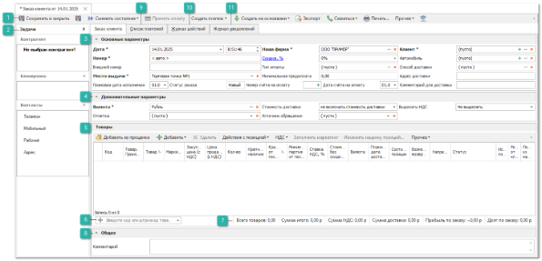

 **Панель действий**

Содержит следующие команды:

- **Сохранить и закрыть/Сохранить** – позволяет сохранить и закрыть/сохранить документ **Заказ клиенту** без проводки;

- **Сменить состояние** – позволяет осуществить проводку документа или отменить ее, в случае необходимости.  А так же добавить документ в архив или извлечь его из архива;

- **Принять оплату** – позволяет отобразить форму оплаты заказа клиента;

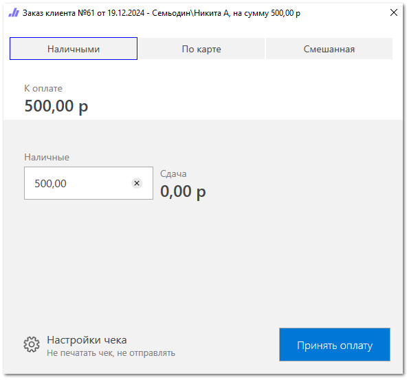

- **Создать платеж** – содержит выпадающий список команд для формирования платежных документов:

    - **Приходный кассовый ордер**;

    - **Платежное поручение входящее**;

    - **Оплата по банковской карте**.

- **Создать на основании** – содержит выпадающий список команд позволяющих создать на основании заказа следующие документы:

    - **Задание на отгрузку товара** – позволяет создать документ **Задания на отгрузку товара** для позиций находящихся в состоянии **Резерв** или **Резерв из наличия**;

    - **Отказ клиента** – позволяет создать документ **Отказ клиента** для позиций находящихся в состояниях: **Заказ клиента**, **Резерв**, **Заказ поставщику**, **Приход**, **Резерв из наличия**, **Отмена резерва**, **Отказ поставщика**, **Возврат поставщику** и **Кор. прихода**;

    - **Заказ поставщику** – позволяет создать документ **Заказ поставщику** для позиций находящихся в состояниях: **Заказ клиента**, **Наш заказ** и **Отказ поставщика**;

    - **Заказ клиента (копия с позициями)** – позволяет создать документ **Заказ клиента** с копированием позиций из табличной части **Товары**;

    - **Перемещение товаров по местам выдачи заказов** – позволяет создать документ **Перемещения товаров**;

    - **Заказ-наряд** – позволяет создать документ **Заказ-наряд** для позиций находящихся в состояниях: **Возврат от клиента**, **Кор. расхода**, **Резерв из наличия**, **Резерв**, **Отмена резерва**, **Приход**, **Заказ клиента** и **Заказ поставщику**;

    - **Расходная накладная** – позволяет создать документ **Расходная накладная** для позиций находящихся в состояниях: **Возврат от клиента**, **Кор. расхода**, **На реализации**, **Резерв из наличия**, **Резерв**, **Отмена резерва** и **Приход**;

    - **Приходная накладная** – позволяет создать документ **Приходная накладная** для позиций находящихся в состояниях: **Возврат поставщику** и **Заказ поставщику**.

- **Экспорт** – команда позволяет экспортировать данные из таблицы в файл.

::: note Замечание

Системой поддерживаются следующие форматы выгружаемых файлов:

- Файлы \*.csv с разделителями "точка с запятой", "табуляция".

- Microsoft Excel 2007 (\*.xlsx);

- Таблица XML 2003 (\*.xml);

- MS Access (\*.mdb).

:::

- **Связаться** – содержит выпадающий список команд для связи с контрагентами:

    - **Позвонить** – по нажатию на команду выполняется звонок выбранному контрагенту/сотруднику на номер, указанный в карточке этого **Контрагента**/ **Сотрудника**;

    - **Открыть чат** – команда позволяет открыть чат с клиентами, подписанными на Telegram-бота;

    ::: info Примечание

    Для работы сервиса отправки уведомлений и сообщений через Telegram-бот необходимо:▪ подключение дополнительной услуги. За подключением услуги обратитесь в отдел продаж Компании Tradesoft;▪ созданный и настроенный Telegram-бот;▪ установленный и подключенный **Сервер Parts.Intellect**.Подробнее о работе модуля читайте в [руководстве пользователя](https://product-doc.tradesoft.ru/ai/telegram/index.htm)

    :::

    - **Уведомить клиента** – позволяет отправить клиенту сообщение по настроенному событию **Заказ клиента готов к выдаче**;

- **Печать** – позволяет отобразить окно **Мастер печати**:

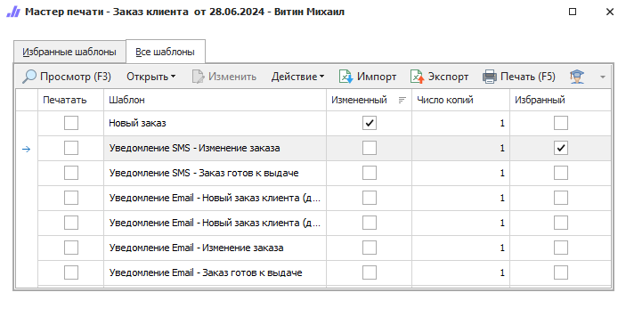

- **Прочее** – содержит выпадающий список с командой **Навигация по связям**, которая позволят отобразить панель с информацией по связанным документам для текущего документа;

- **Помощь** – позволяет открыть руководство пользователя на странице **Создание нового заказа клиента**.

 **Задачи**

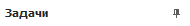

Блок содержит информацию о **Контрагенте**:

- **Контрагент** – отображает следующую информацию:

    - наименование контрагента;

    - **Баланс по заказам**;

    - **Баланс фактический**;

    - **Баланс просроченный**;

    - **Баланс по возвратам**;

    - **Код контрагента** – выводит уникальный номер контрагента;

    - **Категория клиента**;

- **Блокировка** – статус блокировки контрагента;

- **Контакты** – контактные данные контрагента.

 **Основные параметры**

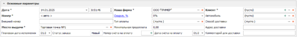

Позволяет задать параметры документа:

- **Дата –** дата и время создания **Заказ клиента**;

- **Номер –** номер документа. Возможен как ручной ввод, так и автозаполнение;

- **Внешний номер –** внешний номер документа;

::: note Замечание

Для пользователя может быть разрешено изменения поля **Внешний номер** даже после проводки документа. Разрешение регулируется опцией **Можно изменять внешний номер документа после проводки** в разделе меню **Управление ► Настройки программы ► Роли пользователей** **► Документы ► Заказы клиентов**

:::

- **Место выдачи –** торговая точка, с которой предполагается выдавать товар клиенту. Данное место выдачи используется при отправке **Уведомления о готовности заказа**, а так же для создания документа **Перемещение** на основании **Приходной накладной**, который позволяет автоматически распределить товар на места выдачи;

::: note Замечание

При активной опции **Учитывать место выдачи товара** в **Заказе клиента** в разделе меню **Управление ►** **Настройки программы ► Настройки,** группа **Уведомления** уведомление о готовности заказа клиента к выдаче будет уходить только в случае, если товар был оприходован либо перемещен на склад/торговую точку, которая указана в качестве **Место выдачи** товара в параметрах **Заказ клиента**.

:::

- **Наша фирма –** наша фирма на которую оформляется заказ;

- **Скидка, %/Наценка, %** (значение меняется при нажатии на имя поля) – значение процента скидки или наценки, которое применяется на все позиции документа. Значение можно указывать в процентах в поле **Скидка (расчетная), %**, или указать непосредственно **Сумму скидки**. Значения полей рассчитываются автоматически на основании значения второго поля;

::: note Замечание

Доступ к полю определяется разрешением пользователя **Можно изменять скидку/наценку** в разделе меню **Управление ► Настройки программы ► Роли пользователей ► Документы ► Заказы клиентов**.

:::

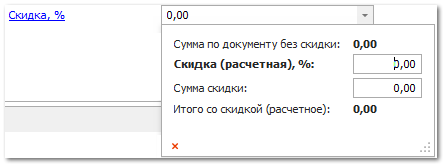

- **Тип оплаты –** способ внесения предоплаты по документу из словаря **Способы оплаты**;

- **Минимальная предоплата –** сумма предоплаты за заказ. Рассчитывается автоматически на основании процента, заданного в настройке **Минимальный % предоплаты по ЗК**, в разделе меню **Управление ► Настройки программы ► Настройки**, группа **CRM ► Контрагенты** – для всех клиентов или с помощью аналогичной настройки в карточке клиента в разделе **CRM** **► Клиенты**, вкладка **Финансы**. Настройка в карточке клиента имеет наивысший приоритет. Полученная сумма предоплаты округляется до целого в большую сторону, редактирование суммы вручную недоступно;

::: note Замечание

Для применения процента необходимо также активировать опцию **Запретить проводить ЗК без минимальной предоплаты** (раздел **Управление ► Настройки программы ► Роли пользователей ► Документы ► Заказы клиентов**). При активном значении настройки проведение документа **Заказ клиента** без внесения предоплаты будет недоступно.

При наличии суммы **Минимальная предоплата** во время проведения заказа будет открыт интерфейс оплаты, в поле ввода автоматически проставится сумма, равная **Минимальная предоплата** (внесение суммы меньше недоступно). После принятия оплаты будет создан платежный документ и долг по документу сократится на сумму предоплаты. Отобразить интерфейс оплаты без использования предоплаты можно с помощью опции **Предлагать оплатить документ при проводке** в разделе **Управление ► Настройки программы ► Роли пользователей ► Документы ► Заказы клиентов**. Способы оплаты определяются настройкой **Доступные типы оплат** в том же разделе.

:::

- **Клиент –** клиент, который заказывает товар. Клиента можно выбрать из справочника контрагентов, открыть форму для создания нового или ввести данные клиента для поиска по справочнику. Поиск ведется по наименованию, коду, номеру дисконтной карты, номерам телефона и мобильного телефона, электронной почте, номеру ИНН, а также системному штрихкоду клиента. При вводе текста предлагается список клиентов из справочника, у которых встречается введенная последовательность символов. Если был выбран существующий контрагент из справочника, то программа привяжет его к документу.

::: note Замечание

Если в карточке контрагента заполнены поля **Способ доставки по умолчанию**, **Адрес доставки**, а на вкладке **Автомобили** есть добавленные автомобили, то при выборе этого клиента в документе **Заказ клиента**:

- в поле **Автомобиль** появится выпадающий список с возможностью выбрать автомобиль клиента;

- в поле **Способ доставки** подставится значение из карточки;

- в поле **Адрес доставки** подставится значение из карточки.

:::

- **Автомобиль –** автомобиль клиента. В поле отображается: марка и модель автомобиля, VIN-код, год выпуска, объем, типа и номер двигателя (при условии, что данная информация внесена в справочник **Автомобили**);

- **Способ доставки –** способ доставки товара;

- **Адрес доставки –** адрес клиента для доставки;

- **Плановая дата исполнения –** значение рассчитывается автоматически на основании значения самой поздней **Плановая дата доставки** среди позиций документа. Подразумевается, что весь заказ может быть полностью исполнен, когда будет доставлена последняя деталь из заказа;

::: note Замечание

Значение поля **Плановая дата исполнения** не может быть меньше, чем значение поля **Дата**.

:::

- **Статус заказа –** значение устанавливается программой. Для вычисления статуса используются данные о состоянии позиций, проводке, плановой дате исполнения и дате готовности к выдаче. Поле **Статус заказа** принимает следующие значения:

    - **Новый** – документ **Заказ клиента** не проведен;

    - **В работе** – позиции документа **Заказ клиента** не готовы к выдаче и требуют внимания менеджера;

    - **В работе, просрочен** – позиции документа **Заказ клиента** не готовы к выдаче, требуют внимания менеджера, а значение поля **Плановая дата исполнения** раньше текущей даты;

    - **Ожидает выдачи, n дней** – позиции документа **Заказ клиента** готовы к выдаче, а значение поля **Дата готовности к выдаче** раньше текущей даты на **n** дней;

    - **Исполнен** – все позиции документа **Заказ клиента** достигли конечного состояния: **Возврат от клиента**, **Отказ клиента**, **Расходная накладная**, **Заказ-наряд**, **Корректировка расходной накладной**;

- **Номер счёта на оплату –** если есть необходимость формирования счета на оплату для клиента, нажмите на кнопку ![ref34] для присвоения номера новому счету (распечатать счет можно через команду **Печать**).

- **Дата счёта на оплату –** устанавливается автоматически, для изменения даты нажмите на кнопку ![ref35] и выберите нужную дату с помощью календаря;

- **Комментарий для доставки –** поле для ввода комментария.

 **Дополнительные параметры**

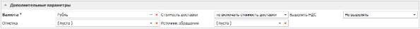

Блок содержит поля:

- **Валюта** – валюта цен в документе. Если изменить валюту документа программа предложит сконвертировать цены на позиции к валюте документа по текущему курсу для валют;

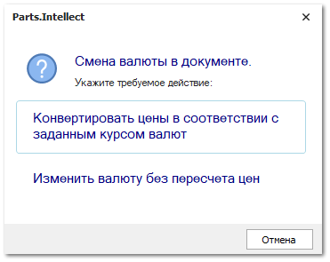

- **Отметка** – отметка для документа из справочника;

- **Стоимость доставки** – влияние стоимости доставки на цену закупа:

    - **Не включать стоимость доставки** – суммарное значение по колонке **Стоимость доставки** не будет влиять на общую сумму документа;

    - **Включать стоимость без учета скидки** – сумма колонки **Стоимость доставки** будет прибавлена к сумме по документу;

    - **Включать стоимость с учетом скидки** – на стоимость доставки будет действовать **Скидка, %/Наценка, %** по документу.

- **Источник обращения** – источник добавления документа в журнал. Возможные источники и отметки:

    -  – документ был передан с сайта Parts.Resource при тике синхронизации;

    -  – документ был создан из окна звонка. Доступно при наличии подключенной IP-телефонии;

    - 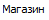 – источник, который можно присвоить документам вручную;

    -  – документ загружен с почты с использованием правила из раздела **CRM ► Автоимпорт заказов клиентов**.

::: note Замечание

Источники **Сайт**, **Звонок**, **Email** присваиваются документам автоматически. При необходимости источник можно изменить вручную. Отредактировать источники и цвета отметок можно в разделе **Управление** ► **Справочники** ► **Источники обращений**.

:::

- **Выделять НДС** – определяет наличие ставки НДС при расчете стоимости позиций, по умолчанию значение берется из карточки **Нашей фирмы**. При необходимости значение можно изменить.

 **Товары**

Панель действий блока содержит следующие команды:

- **Добавить из проценки** – позволяет открыть инструмент проценки, для поиска и добавления в документ необходимых позиций товаров.

- **Добавить** – позволяет добавить товары в заказ**.** Доступны следующие источники позиций:

    - **Из справочника** – позиция будет добавлена в документ без цен из справочника **Товары**;

    - **Из справочника через проценку –** позицию можно будет выбрать вначале в справочнике товаров, а затем она будет передана в **Проценку** для подбора предложений;

    - **Из корзины** – позиции будут добавлены из корзины;

    - **Копия позиции** – будет создана копия выделенной позиции документа.

- **Удалить** – позволяет удалить позицию из табличной части;

- **Действия с позицией** – позволяет произвести действия с позицией:

    - **Добавить в корзину** – добавляет выбранные в табличной части товары в корзину пользователя;

    - **Создать новые товары** – позволяет добавить выделенные товары в справочник **Товары**, если ранее карточка товара не была создана;

    - **Приоритетный склад** – позволяет указать **Приоритетный склад списания** из справочника **Склады/Торговые точки**. Указать приоритетный склад для списания можно так же в самой позиции документа, в колонке **Приоритетный склад для списания**. 

::: note Замечание

По умолчанию списание товара (в момент проводки) будет осуществляться среди всех складов доступных для списания пользователю, по действующему в системе **Способу списания товара ФИФО/ЛИФО** в разделе меню **Управление ► Настройки программы ► Настройки ►** группа **Склад и закупки ► Движение товара.**

:::

- **НДС** – содержит следующие команды:

    - **Изменить ставку НДС** – позволяет изменить ставку НДС для выбранных позиций;

    - **Установить приоритет цен с НДС/Снять приоритет цен с НДС  –** позволяет установить/снять приоритет цен с НДС, который определяет ключевую цену, на основании которой будет высчитываться вторая цена при переключении в параметрах документа значения **Выделять НДС**:

        - если для позиции активирована опция **Установить приоритет цен с НДС**, то при включении переключателя **Выделять НДС** значение в колонке **Цена с НДС** не изменится, а **Цена без НДС** рассчитается на ее основании;

        - убрать приоритет цен можно с помощью опции **Снять приоритет цен с НДС**, если приоритет снят, то при включении переключателя **Выделять НДС** значение в колонке **Цена без НДС** не изменится, а **Цена с НДС** рассчитается на ее основании.

- **Заполнить маркетинг** – позволяет автоматически подставить информацию о позиции из существующих маркетингов. Доступна подстановка:

    - **Закупочной цены** **(с НДС)** – цена закупа детали у поставщика;

    - **Цены продажи (с НДС)** – цена на товар с учетом маркетинга;

    - **Направления/ склада** – направление поставки или склад из прайс-листа;

    - **Приоритетного склада для списания** – склад, с которого требуется осуществлять списание товара;

::: note Замечание

Заполнить маркетинг можно как для одной позиции из документа, нажав кнопку **Обновить**, так и для всех, нажав кнопку **Для всех** в открывшемся окне.Функция **Заполнить маркетинг** в **Заказах клиентов** доступна только для позиций с пустым полем **Маркетинг** из источников: **Прайс-листов наличия** и **Прайс-лист поставщика**. Функция активна только для не проведенных документов.Для подстановки цен по позиции выполняется проценка с поиском позиции в источниках (из маркетинга, под заказ, из наличия, в пути). Проценка осуществляется в 3 этапа, поиск позиции осуществляется по точному совпадению, поиск по аналогам и синонимам не осуществляется:

- **1 этап**:

    - Проверка источника на доступность (в соответствии с разрешениями пользователя в разделе **Управление** **► Настройки программы ► Разрешения для роли пользователей ►  Прайс-листы**;

    - Получение товара из прайс-листа;

    - Загрузка списков маркетингов;

    - Разбитие позиции по складам;

    - Выбор подходящего маркетинга (проверка по диапазону цен, группе скидок, производителю, группе товаров и т.д.);

    - Для товаров в наличии: исключение позиций с неподходящим складом/ Торговой точкой, на которой расположен товар (в соответствии с выбранным Складом/ Торговой точкой в документе);

    - Исключение маркетингов, не подходящих по категории клиента;

    - Для каждого подходящего маркетинга высчитывается цена;

    - Выбор одного маркетинга по весам.

- **2 этап**:

    - Удаление дубликатов из списка процененных позиций товара;

- **3 этап**:

    - Возврат списка процененных позиций из разных источников. В качестве результата берется первый из списка товар.

Для партионной СЦО выполняется сортировка по дате из **Приходной накладной**. Выбор позиции товара из проценки зависит от настройки **Способ списание товара** (**ЛИФО**, **ФИФО**), который задается в разделе **Управление ► Настройки программы ► Настройки ►** группа **Склад и закупки ► Движение товара**. Если в списке присутствуют только позиции из **Прайс-листов поставщиков**, по которым нет **Приходных накладных** – сортировка не выполняется.

:::

- **Изменить наценку позиций** – позволяет установить наценку, либо скидку на выделенные позиции. На форме указывается от какой цены необходимо начислять наценку или скидку, а также размер скидки/наценки: фиксированный; из карточки товара. Далее с помощью опции **Применить правила округления валюты** можно округлить полученное значение.

- **Прочее** – содержит выпадающий список команд:

    - **Показать/скрыть изображения** – позволяет открыть окно **Изображения**, в котором содержатся изображения выбранного товара;

    - **Информация** – позволяет отобразить информацию о предыдущих документах и позициях выбранного товара.

Табличная часть **Товары** содержит список добавленных позиций в документ **Заказ клиента**.

::: note Замечание

Список, порядок и отображение столбцов в **Табличной части** настраивается индивидуально каждым пользователем программы.Для отображения/скрытия колонок используется команда **Выбор колонок**, которая открывает одноименное окно.

:::

Доступные колонки табличной части **Товары**:

- **Базовая валюта –** валюта, в которой были указаны цены, на момент добавления позиции в документ;

- **Базовая закупочная цена –** цена закупа из "источника" добавления на момент добавления позиции в документ (обычно цена от поставщика);

- **Базовая цена продажи –** цена продажи из "источника" позиции на момент добавления позиции в документ;

- **В наличии на доступных складах** – общее наличие по товару на всех складах, доступных пользователю для работы;

- **В резерве на доступных складах** – общее количество зарезервированного товара на всех складах, доступных пользователю для работы;

- **Валюта** –** валюта товара подставляемая на основании **Валюта** документа;

- **Веб-Инфо** – колонка содержит команду вызова окна, содержащего общую информацию и изображения детали из сервиса веб-инфо (по вопросу подключения сервиса можно уточнить информацию в отделе продаж);

- **Внутренний код** – **Внутренний код** из карточки товара;

- **Внутренний код поставщика** – **Внутренний код** товара из прайс-листа поставщика;

- **Внутренний резерв –** отображает время до окончания **Внутреннего резерва** по позиции (**Управление ► Настройки программы ► Настройки ►** группа **Склад и закупки ► Движение товара**);

- **Возможность возврата** – отображает признак возможности возврата из прайс-листа; 

- **Время доставки –** время доставки товара;

- **Группа товара** – основная группа товара из карточки;

- **Дополнительные свойства товара** – дополнительные свойств товара из карточки;

- **Единица измерения** – указывает **Единица измерения** из карточки товара;

- **Закупочная цена (без НДС)** – цена закупа детали у поставщика** без учета НДС;

- **Закупочная цена (с НДС)** – цена закупа детали у поставщика с учетом значения колонки **Ставка НДС, %**;

- **Закупочная цена со скидкой и доставкой (с НДС)** – цена закупа с учетом процента скидки/наценки по документу и НДС;

- **Закупочная цена со скидкой и доставкой (без НДС)** – цена закупа с учетом процента скидки/наценки по документу и без учета НДС** ;

- **Замены товара** – поле заполняется информацией об исходном замененном коде товара в документе (например, если в заказе поставщику был отличный артикул);

- **Идентификатор в Parts.Resource –** краткий символьный идентификатор** товара на сайте Parts.Resource;

- **Источник позиции –** источник позиции товара;

- **Итоговая стоимость (без НДС)** – стоимость товара с учетом процента скидки/наценки по документу и значения колонки **Стоимость доставки** (если включен ее учет);

- **Итоговая стоимость (с НДС)** – стоимость товара с учетом процента скидки/наценки по документу, значения колонок **Стоимость доставки** (если включен ее учет) и **Ставка НДС,** % (если выделяется НДС);

- **Категория клиента из маркетинга** – категория клиента из **Маркетинг** (если к позиции применен маркетинг)** ;

- **Код** – артикул детали;

- **Кол-во** – количество товара;

- **Количество по доставке** – количество товаров, партий и т.п. для расчета **Стоимости доставки**;

- **Кратность наличия** – коэффициент, согласно которому может быть выбрано количество для заказа из наличия. Также выполняет роль минимального количества к заказу;

- **Кратность от поставщика –** коэффициент, согласно которому может быть выбрано количество для заказа от поставщика. Также выполняет роль минимального количества к заказу;

- **Маркетинг** – информация о **Маркетинге**, который применился к позиции при добавлении из **Проценки** или **Корзины**;

- **Меньше минимальной партии от поставщика –**  указывает признак если **Кол-во** товара меньше, чем **Минимальная партия от поставщика**;

- **Минимальная партия от поставщика –** минимальное количество единиц товара под заказ в одной партии;

::: note Замечание

Чтобы настроить разрешение на проведение документа с количеством меньше минимальной партии, в разделе **Управление ► Настройки программы**, вкладка **Роли пользователей ► Разрешения для роли пользователей,** группы настроек **Заказы клиентов, Наши заказы на склад, Заказы поставщикам, VIN-запросы** воспользуйтесь настройкой **Можно проводить с количеством меньше минимальной партии поставщика** для нужных документов и пользователей.

:::

- **Направление/Склад** – направление поставки или склад из прайс-листа;

- **Наценка, %** – наценка на товары в отношении закупочной цены к цене продажи по документу;

- **Не соответствует кратности наличия** – отметка о несоответствии кратности из наличия товара;

- **Не соответствует кратности от поставщика –** отметка о несоответствии кратности товара от поставщика;

- **Плановая дата доставки –** отображает дату доставки детали;

- **Плановая цена –** отображает ориентировочную версию итоговой цены товара;

- **Плановое количество –** отображает ориентировочную версию итогового количества товара;

- **Подакцизный товар** – указывает признак **Подакцизный товар** из карточки товара;

- **Последняя цена продажи из РН** – цена продажи из последней **Расходной накладной** по товару;

- **Поставщик из маркетинга –** отображает поставщика указанного в примененном к позиции маркетинге;

- **Примечания** – примечание к позиции;

- **Приоритет цен с НДС** – позволяет установить/снять приоритет цен с НДС, который определяет ключевую цену, на основании которой будет высчитываться вторая цена при переключении в параметрах документа значения **Выделять НДС**;

- **Приоритетный склад для списания** – склад, с которого требуется осуществлять списание товара;

- **Референс от клиента –** содержит информацию по товару от клиента;

- **Свойства от клиента –** содержит информацию по свойствам товара от клиента;

::: note Замечание

В полях **Референс от клиента** и **Свойства от клиента** содержится информация от клиента для идентификации позиции, например,** информацию по которой понимает по какому прайс-листу поставщика/договору оформляется заказ.

:::

- **Системный штрихкод** – штрихкод позиции документа, присваиваемый системой;

- **Состояние позиции** – состояние (и подсостояние) позиции;

- **Ставка НДС, %** – значение ставки в процентах;

- **Статус** – статус товара;

- **Стоимость без скидки (с НДС)** – стоимость товара без скидки с учетом НДС;

- **Стоимость доставки** – сумма по доставке товара (**Цена доставки** \* **Количество по доставке**);

- **Сумма НДС** – сумма НДС по позиции с учетом процента скидки/наценки;

- **Товар** – наименование детали (из источника позиции);

- **Товар. Альтернативное название** – **Альт. наименование** указанное в карточке товара;

- **Товар. Название –** наименование детали из карточки товара;

- **Товар. Производитель** – **Производитель** товара из карточки товара;

- **Товар. Стандартная наценка** – **з**начение наценки и карточки товара;

- **Цена доставки** – значение из справочника **Стоимости доставок** ;

- **Цена закупа в прайс-листе из наличия –** значение **Цена закупа** в **Прайс-листе из наличия** (только для **Расширенной** схемы ценообразования);

- **Цена продажи (без НДС)** – цена продажи, если она присутствовала в "источнике" позиции** или была введена вручную;

- **Цена продажи (с НДС)** – цена продажи, если она присутствовала в "источнике" позиции или была введена вручную, с учетом процента скидки/наценки по документу (если выделяется НДС);

- **Цена продажи со скидкой и доставкой (без НДС)** – цена продажи, если она присутствовала в "источнике" позиции** или была введена вручную, с учетом процента скидки/наценки по документу, значения колонок **Стоимости доставки** (если включен ее учет) и **Ставка НДС,** **%** (если выделяется НДС);

- **Цена продажи со скидкой и доставкой (c НДС)** – цена продажи, если она присутствовала в "источнике" позиции или была введена вручную, с учетом процента скидки/наценки по документу, значения колонки **Стоимости доставки** (если включен ее учет);

- **Штрихкод внутренний** –** внутренний штрихкод из карточки товара.

 **Найти/Добавить**

Поле предназначено для поиска товара или добавления найденной позиции через проценку по коду детали.

 **Строка информации**

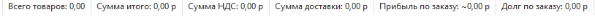

Отображает информацию по позициям в документе:

- **Всего товаров** – количество товаров добавленных в табличную часть;

- **Сумма итого** – суммарная стоимость товаров добавленных в табличную часть;

- **Сумма НДС** – суммарное значение НДС по всем позициям товаров в табличной части;

- **Сумма доставки** – суммарная стоимость доставки для всех товаров;

- **Прибыль по заказу** – суммарная прибыль по всем позициям товаров в табличной части;

::: note Замечание

По умолчанию поле **Прибыль по заказу** не отображено в информационной строке. Для его отображения необходимо включить видимость в разделе **Управление ► Настройки программы ► Роли пользователей ► Разрешения для роли пользователей ► Документы ► Заказы клиентов** в группе **Видимость**.

:::

- **Долг по заказу** – общая задолженность по товарам добавленным в табличную часть.

 **Общее**

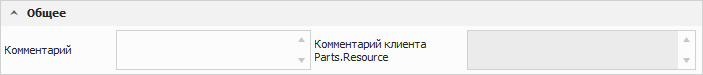

Блок содержит поля:

- **Комментарий** – позволяет оставить комментарий к заказу клиента;

- **Комментарий клиента Parts.Resource** – содержит комментарий клиента к заказу, полученный с сайта Parts.Resource.

::: info Примечание

Поле **Комментарий клиента Parts.Resource** доступно при подключенной услуге Синхронизатор. Подробнее читайте в [руководстве пользователя](https://product-doc.tradesoft.ru/ai/synch/index.htm).

:::

 **Список платежей**

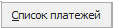

Список содержит информацию о платежах по данному заказу.

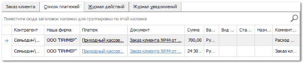

 **Журнал действий**

Данный журнал отражает действия всех пользователей с документом.

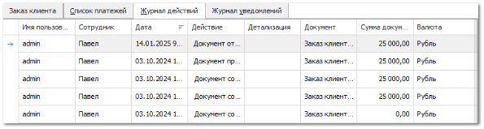

 **Журнал уведомлений**

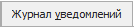

Журнал содержит информацию о работе системы уведомлений клиентов и менеджеров, через Email, SMS и Telegram по документу. В журнал выводятся все события по отправке уведомлений, как успешные, так и нет.

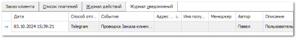

::: info Примечание

Отправка уведомлений через приложение Telegram доступно только для пользователей с подключенным модулем.

:::