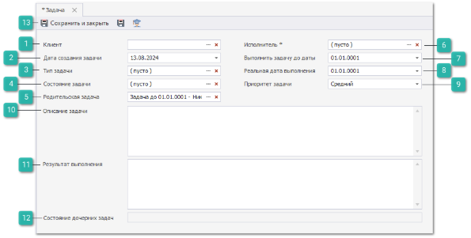
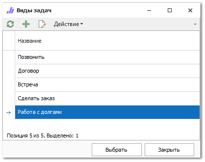
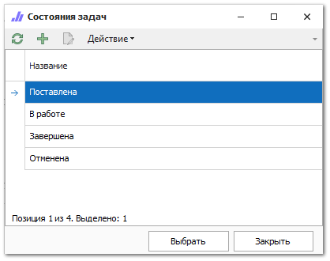
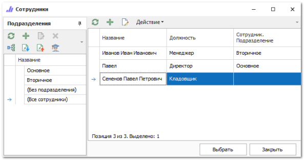

По нажатию команды  в разделе **Задачи** создается карточка новой задачи.

 **Клиент**

Позволяет указать клиента из справочника **Контрагенты**.

 **Дата создания задачи**

Позволяет указать дату создания задачи, по умолчанию указывается текущая дата.

 **Тип задачи**

Позволяет указать значение из справочника **Виды задач**.

 **Состояние задачи**

Позволяет указать состояние задачи из справочника **Состояния задач**.

 **Родительская задача**

Позволяет указать задачу являющуюся родителем текущей задачи.

 **Исполнитель**

Позволяет указать исполнителя задачи из справочника **Сотрудники**.

 **Выполнить задачу до даты**

Позволяет указать необходимую дату выполнения задачи.

 **Реальная дата выполнения**

Позволяет указать фактическую дату выполнения задачи

 **Приоритет задачи**

Позволяет задать уровень приоритетности задачи. Содержит выпадающий список:

- **Низкий**;

- **Средний**;

- **Высокий**.

 **Описание задачи**

Позволяет указать для исполнителя описание задачи.

 **Результат выполнения**

Позволяет описать результат выполнения задачи.

 **Состояние дочерних задач**

Отображает все **Состояние задачи** дочерних задач через разделитель ",".

 **Панель действий**

Содержит команды:

- **Сохранить и закрыть/Сохранить** – позволяет сохранить и закрыть/сохранить документ без проводки;

- **Помощь** – позволяет открыть руководство пользователя по разделу.