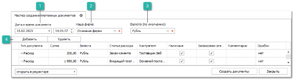
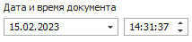
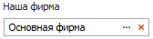
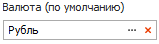
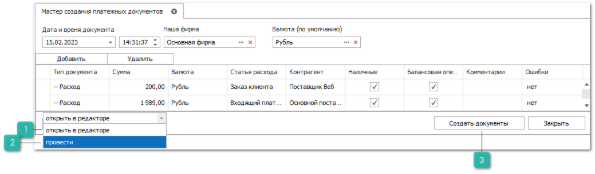

Мастер платежных документов позволяет быстро создать платежные документы (ПКО, РКО, ПП, ППвх).

Работа с мастером заключается в следующем:

**»** Задаем дату документов, выбираем Нашу фирму и Валюту документа (по молчанию). Затем нажимаем кнопку **Добавить**.

 **Дата и время документа**

Позволяет задать дату и время создания документа.

 **Наша фирма**

Позволяет задать фирму, от лица которой будет создан документ.

 **Валюта (по умолчанию)**

Позволяет указать валюту документа по умолчанию из справочника **Валюты**.

 **Добавить**

Позволяет добавить новую строку в **Мастер создания платежных документов**.

**»** В добавленной строке заполняем информацию: тип документа, сумма, валюта, статья расходов или доходов, контрагент, указать наличный или нет платежный документ, указать балансовая или нет операция, по необходимости комментарий.

**»** Для добавления нового платежа нажимаем кнопку **Добавить**. Появится новая позиция в таблице. Часть данных в новой позиции будет взята из позиции, на который был курсор в момент нажатия кнопки **Добавить**.

**»** Выбираем действие по отношению к создаваемым документам: **Открыть в редакторе** или **Провести**.

 **Открыть в редакторе**

Позволяет открыть документ в редакторе после его создания.

 **Провести**

Позволяет провести документ после его создания.

 **Создать документы**

Позволяет создать документы на основе введенных данных.

**»** Нажимаем кнопку **Создать документы**. Тем самым, в зависимости от выбранного действия, будут созданы документы и открыты в редакторе, либо сразу проведены.