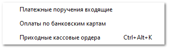

Данный подраздел содержит в себе документы, которые формируются при безналичном (**Платежные поручения входящие**), с помощью банковской карты (**Оплаты по банковским картам**) и наличном (**Приходный кассовый ордер**) зачислении денежных средств от контрагентов в программе.

::: info Примечание

Если платеж не является "балансовым", он отображается в журнале документов курсивным начертанием и серым цветом шрифта.

:::

