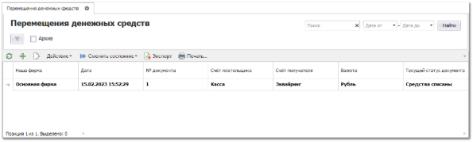

Пункт меню содержит список документов **Перемещение денежных средств**, который используются для перемещения денежных средств между счетами Нашей фирмы.

Возможные состояния документа:

- **Черновик**;

- **Средства списаны**;

- **Средства получены**.

::: info Примечание

Недоступно перемещение денежных средств между счетами разных **Наших фирм**.

:::

В документе указывается Наша фирма, счет нашей фирмы – с которого будут списаны деньги, счет нашей фирмы – на который будут переведены деньги, и сумма перевода.

Затем у документа меняется состояние с **Черновик** на **Средства списаны**. Тем самым документ вступает в силу, и денежные средства списываются со счета плательщика.

Для фиксации поступления денежных средств на счет получателя, необходимо еще раз сменить состояние документа на **Средства получены**.

::: info Примечание

Документ не влияет на балансы **Нашей фирмы**, но выводится в отчете о движении денежных средств.

:::