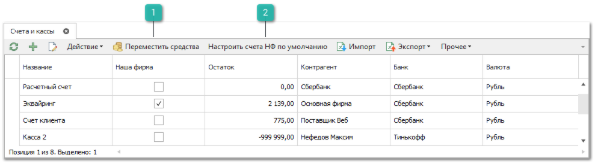

Справочник используется для заполнения счетов контрагентов и касс наших фирм. Каждая запись содержит информацию о номере счета/названии кассы, валюте, контрагенте и банке. Счета/кассы выбираются в платежах в качестве счета-получателя или счета-плательщика.

Панель действий содержит стандартные команды и некоторые уникальные команды:

 **Переместить средства**

Позволяет осуществить перемещение денежных средств между счетами Нашей фирмы, откроет мастер создания документа **Перемещение денежных средств**.

 **Настроить счета НФ по умолчанию**

Позволяет настроить **Счета/Кассы**, которые по умолчанию будут подставляться в платежные документы при их создании. **Счета/Кассы** устанавливаются в соответствии с критериями, значения которых определяются системой на момент создания документа:

- **Наша фирма***.* **Активная Наша Фирма** текущего пользователя программы;

- **Торговая точка**. **Активная Торговая точка** текущего пользователя программы;

- **Пользователь**. Пользователь, который создает платежный документ;

- **Тип платежа**. Тип создаваемого платежного документа. Перечень значений: **ПКО**, **РКО**, **ПП**, **ППвх**.

    - для **ПКО** и **ППвх** (тип оплаты **Безналичная**) указывается счет получателя в платежах;

    - для **РКО** и **ПП** (тип оплаты **Безналичная**) указывается счет плательщика в платежах;

Приоритет критериев соответствует следующему порядку: **Наша фирма**, **Торговая точка/Склад**, **Пользователь**.

::: warning Внимание!

Изменение реквизитов влияет на **Счет/Кассу** только в новых платежах. Уже имеющиеся документы остаются без изменений.

:::
С помощью данного инструмента можно настроить для одного и того же пользователя, в зависимости от **Торговой точки**, разные **Счета/Кассы** по умолчанию.

В случае, когда в фирме только одна **Счет/Касса**, в правилах можно настроить это значение по умолчанию для любых пользователей.