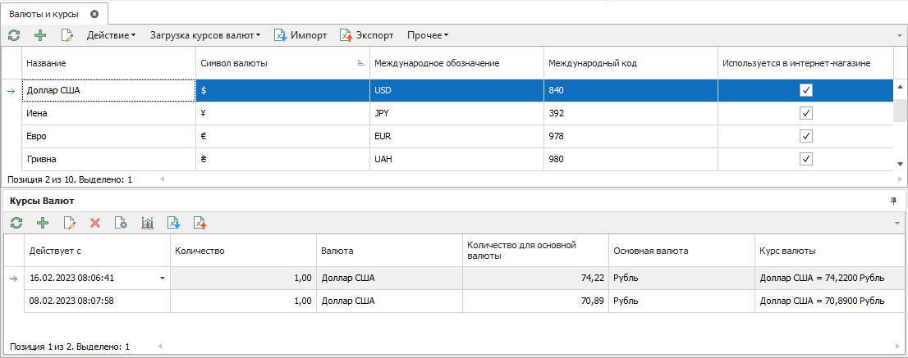
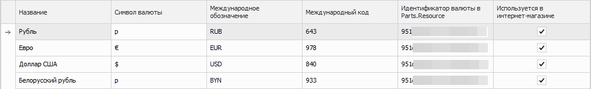
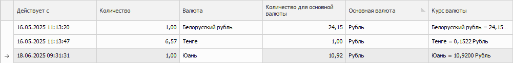

Справочник **Валюты и курсы** предоставляет доступ к списку валют, используемых в системе, и курсов между ними.

Справочник содержит элементы:

- [панель действий валют](#панель-действий-валют);

- [табличная часть](#табличная-часть-валют);

- [панель действий курсов валют](#панель-действий-курсов-валют);

- [курсы валют](#курсы-валют).

## Панель действий валют

Панель содержит следующие команды:

-  **Обновить** – позволяет обновить табличную часть;

-  **Добавить** – позволяет добавить новую валюту;

-  **Редактировать** – позволяет отредактировать валюту;

- **Действие** – содержит команду Удалить, которая позволяет удалить запись валюты;

- **Загрузка курсов валют** – позволяет осуществить загрузку курсов валют. Загрузка курсов:

    - **Загрузить** – осуществляет загрузку курсов в ручном режиме, в случае если в карточке валюты подключен источник для получения курсов валют;

    - **Создать bat-файл** – позволяет создать bat-файл, для загрузки курсов валют в автоматическом режиме;

-  **Импорт** – позволяет импортировать валюты;

-  **Экспорт** – позволяет экспортировать валюты;

- **Прочее** – содержит команду **Поместить в очередь синхронизатора**, которая позволяет поместить выбранные валюты и курсы в очередь синхронизатора на загрузку в систему Parts.Resource.

::: note Замечание

Для работы команды необходимо наличие подключенного сервиса синхронизации и заполненных настроек в разделе **Управление ► Настройки программы ► Настройки ► CRM ► Обмен данными с Parts.Resource**.

:::

## Табличная часть валют

Табличная часть содержит следующие столбцы:

- **Название** – наименование валюты;

- **Символ валюты** – обозначение валюты, которое будет отображается в печатных формах;

- **Международное обозначение** – буквенное обозначение валюты по стандарту ISO;

- **Международный код** – код валюты по стандарту ISO 4217:2012. Используется при автоматическом обновлении курсов валют и обмене данными с внешними системами, например, онлайн-платежах;

- **Идентификатор валюты в Parts.Resource** – выводит идентификатор валюты в Parts.Resource. Идентификатор создается, даже если валюта не передается на сайт;

- **Используется в интернет-магазине** – отображает признак, используется ли валюта в интернет-магазине Parts.Resource.

::: note Замечание

Признак **Используется в интернет-магазине** назначается при создании валюты. В будущем вы сможете изменить признак при помещении валюты в очередь синхронизатора (команда **Поместить в очередь синхронизатора**)

:::

## Панель действий курсов валют

Содержит следующие команды:

-  **Обновить** – позволяет обновить табличную часть курсов валют;

-  **Добавить** – позволяет добавить новый курс валюты;

-  **Редактировать** – позволяет отредактировать курс валюты;

-  **Удалить** – позволяет удалить курс валют;

-  **Сбросить кэш курсов** – позволяет сбросить локальный кэш курсов валют в ручную;

-  **Анализ курсов** – позволяет открыть окно **Анализа курсов валют**, для проведения анализа кросс-курсов – оценить наличие курсов между существующими валютами и оперативно заполнить отсутствующие курсы, перемещаясь по иконкам на пересечении валют. Иконки на пересечении валют отражают текущее состояние:

    -  – для выбранных валют на пересечении строки и столбца есть хотя бы один заданный курс в справочнике **Курсы валют**;

    -  – курс для выбранных валют существует лишь в виде обратного курса и активированной опции **Автоматически вычислять обратный курс валют** в **Управление ► Настройки программы ► Настройки ►** группа **Системные настройки**. Это состояние хранит в себе потенциальную угрозу, так как если выключить эту опцию – валюты между собой не будут связаны курсом;

    -  – курс между выбранными валютами не задан. Двойной клик по иконке откроет инспектор ввода нового курса валют с заполненными валютами. Останется лишь ввести числовые значения курса и сохранить запись.

    -  – позволяет открыть инспектор для редактирования валюты, выполнив двойной клик по иконке.

::: warning Внимание!

Вопросу заполнения курсов между всеми валютами следует уделять особое внимание, так как отсутствие курса может запретить выполнение некоторых операций (проводка документов и т.д.).

Наиболее частой ошибкой является правка действующих курсов валют, а не добавление новых. Новые курсы **ВСЕГДА** добавляются в справочник новыми записями. Если не следовать этому правилу, то все валютные операции в прошлом из-за нового курса разойдутся. Потому что, когда программе требуется сконвертировать цены в каком-либо старом документе (для отчетов, подсчета балансов и т.д.), она обращается в справочник курсов с датой документа: какой курс действовал на эту дату. А затем использует найденный курс.

:::

-  **Импорт** – позволяет импортировать курсы валют;

-  **Экспорт** – позволяет экспортировать курсы валют.

## Курсы валют

Табличная часть блока **Курсы валют** содержит список созданных/загруженных курсов для валют. Курс начинает действовать с момента его принятия и заканчивает с принятием нового курса. Исключением является самый "старый" курс (первый введенный курс), который действует не от даты принятия, а с момента установки программы.
Табличная часть состоит из колонок:

- **Действует с** – выводит дату и время, когда начал действовать курс валют;

- **Количество** – выводит количество валюты, для которой высчитывается курс;

- **Валюта** – выводится валюта, для которой высчитывается курс;

- **Количество для основной валюты** – выводит количество для основной валюты, от которой высчитывается курс;

- **Основная валюта** – выводит основную валюту, от которой высчитывается курс;

- **Курс валюты** – выводит курс валюты.