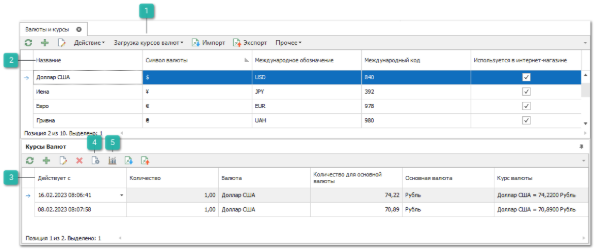
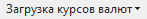
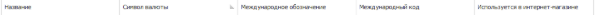
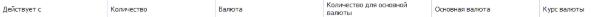
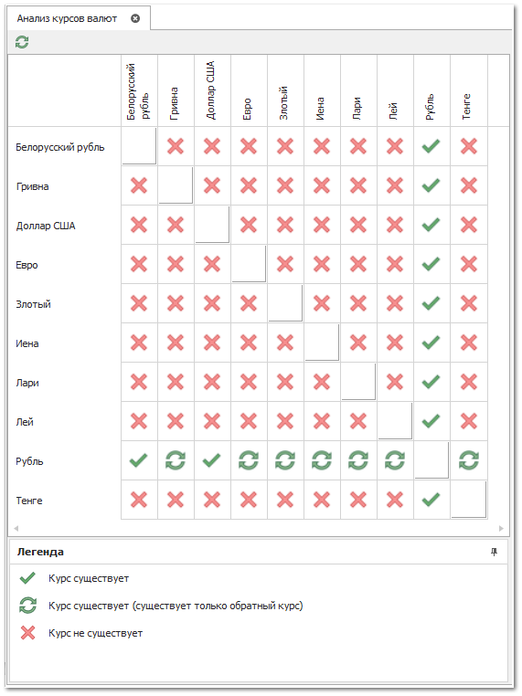

Справочник **Валюты и курсы** предоставляет доступ к списку валют, используемых в системе, и курсов между ними.

 **Загрузка курсов валют**

Позволяет осуществить загрузку курсов валют. Загрузка курсов:

- **Загрузить** – осуществляет загрузку курсов в ручном режиме, в случае если в карточке валюты подключен источник для получения курсов валют;

- **Создать bat-файл** – позволяет создать bat-файл, для загрузки курсов валют в автоматическом режиме.

 **Валюты**

Табличная часть **Валюты** содержит следующие столбцы:

- **Название** – наименование валюты;

- **Символ валюты** – обозначение валюты, которое будет отображается в печатных формах;

- **Международное обозначение** – буквенное обозначение валюты по стандарту ISO;

- **Международный код** – код валюты по стандарту ISO 4217:2012. Используется при автоматическом обновлении курсов валют и обмене данными с внешними системами, например, онлайн-платежах.

 **Курсы валют**

Табличная часть блока **Курсы валют** содержит список созданных/загруженных курсов для валют. Курс начинает действовать с момента его принятия и заканчивает с принятием нового курса. Исключением является самый "старый" курс (первый введенный курс), который действует не от даты принятия, а с момента установки программы.

 **Сбросить кэш курсов**

Позволяет сбросить локальный кэш курсов валют в ручную.

 **Анализ курсов**

Позволяет открыть окно **Анализа курсов валют**, для проведения анализа кросс-курсов – оценить наличие курсов между существующими валютами и оперативно заполнить отсутствующие курсы, перемещаясь по иконкам на пересечении валют. 

::: warning Внимание!

Вопросу заполнения курсов между всеми валютами следует уделять особое внимание, так как отсутствие курса может запретить выполнение некоторых операций (проводка документов и т.д.).

Наиболее частой ошибкой является правка действующих курсов валют, а не добавление новых. Новые курсы **ВСЕГДА** добавляются в справочник новыми записями. Если не следовать этому правилу, то все валютные операции в прошлом из-за нового курса разойдутся. Потому что, когда программе требуется сконвертировать цены в каком-либо старом документе (для отчетов, подсчета балансов и т.д.), она обращается в справочник курсов с датой документа: какой курс действовал на эту дату. А затем использует найденный курс.

:::

Иконки на пересечении валют отражают текущее состояние:

-  **–** для выбранных валют на пересечении строки и столбца есть хотя бы один заданный курс в справочнике **Курсы валют**;

-  **–** курс для выбранных валют существует лишь в виде обратного курса и активированной опции **Автоматически вычислять обратный курс валют** в **Управление ► Настройки программы ► Настройки ►** группа **Системные настройки**. Это состояние хранит в себе потенциальную угрозу, так как если выключить эту опцию – валюты между собой не будут связаны курсом;

-  **–** курс между выбранными валютами не задан. Двойной клик по иконке откроет инспектор ввода нового курса валют с заполненными валютами. Останется лишь ввести числовые значения курса и сохранить запись.

-  – позволяет открыть инспектор для редактирования валюты, выполнив двойной клик по иконке.