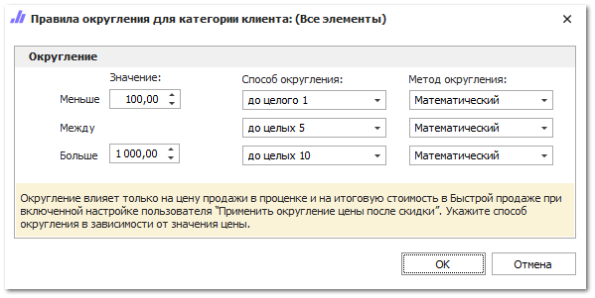

В карточке валюты на вкладке **Округление цен** задаются правила округления цен для данной валюты. Округление цен используются в **Быстрой продаже**, **Проценке**, в **Генерации обобщенного прайс-листа**, при установке **Наценки/Скидки** в заказе клиента. На вкладке задаются правила округления в зависимости от категории клиента.

 **Табличная часть**

Содержит список добавленных правил округления валюты.

::: note Замечание

Список, порядок и отображение столбцов в **Табличной части** настраивается индивидуально каждым пользователем программы.Для отображения/скрытия колонок используется команда **Выбор колонок**, которая открывает одноименное окно.

:::

Доступные колонки табличной части:

- **Категория клиента** – позволяет указать категорию клиента для правила округления цен;

- **Округление** – содержит описание диапазонов настроенного правила округления цен.

 **Панель действий**

Содержит команды:

- **Добавить** – позволяет добавить новое правило округления валюты;

- **Копировать** – позволяет копировать выбранное правило для дальнейшего редактирования;

- **Удалить** – позволяет удалить выбранное правило.

 **Округление**

Позволяет открыть окно редактирования условий округления для заданной категории клиентов.

Окно **Правила округления для категории клиента** содержит:

- значение диапазона – позволяет задать уровни округления цен товаров:

    - **Меньше** – менее значения указанного в поле ввода **Меньше**;

    - **Между** – значения больше значений введенных в поле **Меньше** и меньше значений введенных в поле **Больше**;

    - **Больше** – более значения указанного в поле ввода **Больше**.

- **Способ округления** – позволяет указать способ округления числа для каждого уровня округления;

::: info Примечание

При выборе способов округления, необходимо учесть значение настройки **Число знаков после запятой для финансов** в разделе меню **Управление ► Настройки программы ► Настройки,** группа **Системные настройки**. Настройка определяет количество знаков после запятой для значений цен, при этом знаки просто обрезаются, не учитывая правил округления.

:::

- **Метод округления** – позволяет задать метод округления валюты для указанного уровня округления.

::: note Замечание

Для округления Цены продажи без НДС в документах **VIN-запрос**, **Заказ клиента**, **Резервирование** и **Расходная накладная** в программе так же присутствует дополнительная опция **Включить механизм округления цен без НДС** в разделе меню **Управление ►** **Настройки программы ► Настройки**, группа **Документы**.

При включении данной опции открывается доступ к команде **Округление цены без НДС** для позиций документов **VIN-запрос, Заказ клиента, Резерв и Расходная накладная.** При нажатии на данную команду программа произведет округление Цены **продажи без НДС** до сотых с кратностью 5. Если при проведении документа обнаружатся позиции, не соответствующие данным критериям округления, то при проведении документа пользователю будет выведено диалоговое окно с возможностью выбора: округлить и провести документ, не округлять и провести документ, отмена проводки документа.

:::

::: note Пример

Округление до сотых с кратностью 5:

- цена продажи *120,68 руб.*, после округления – *120,70 руб.*

- цена продажи *120,66 руб.*, после окргления – *120,65 руб.*

:::