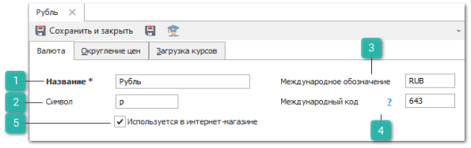
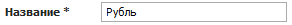
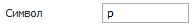
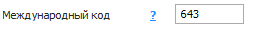
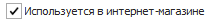

В инспекторе справочника **Валюты и курсы** на вкладке **Валюта** задается наименование валюты, её отображение и обозначение.

 **Название**

Позволяет указать наименование добавляемой валюты.

 **Символ**

Позволяет указать уникальный символ или сокращенное название валюты.

 **Международное обозначение**

Позволяет указать буквенный код валюты по стандарту ISO.

 **Международный код**

Позволяет указать цифровой код валюты по стандарту ISO 4217:2015. Используется при обмене данными с внешними системами, например, для загрузки курсов валют с сайтов национальных банков.

Иконка  – позволяет открыть страницу с информацией для заполнения полей при добавлении валюты.

 **Используется в интернет-магазине**

Позволяет отметить использование данной валюты в интернет-магазине.

::: info Примечание

Для синхронизации справочника валют с валютами сайта **Parts.Resource** необходимо приобрести и настроить услугу **Синхронизатор**. Для подключения обращайтесь в [отдел продаж Tradesoft](https://www.tradesoft.ru/about/contacts/). Подробнее о настройке передачи валют на сайт **Parts.Resource** читайте в [руководстве пользователя **Синхронизатор**](https://product-doc.tradesoft.ru/ai/synch/valyuty_i_kursy.htm).

:::