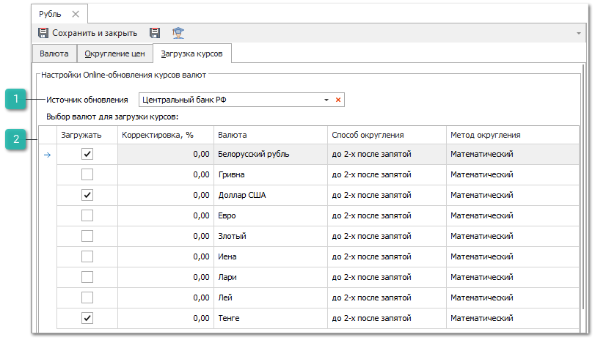
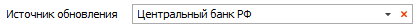
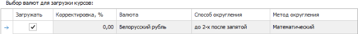

В карточке валюты на вкладке **Загрузка курсов** расположены настройки для автоматической загрузки курсов валют по отношению к выбранной валюте.

 **Источник обновления**

Позволяет указать источник обновления курсов валют.

::: info Примечание

Автоматическое обновление курсов валют возможно для:

- Российского рубля (ISO-код 643) с сайта Центрального банка Российской Федерации – CBR.RU;

- Белорусского рубля (ISO-код 933) с сайта Национального банка Республики Беларусь – NBRB.BY;

- Тенге (ISO-код 398) с сайта Национального банка Республики Казахстан – NATIONALBANK.KZ;

- Гривны (ISO-код 980) с сайта Национального банка Украины.

Доступность источника определяется наличием международного кода в карточке валюты.

Присваивание значений курсов к остальным валютам системы производится согласно их Международному коду.

:::

 **Валюты для загрузки курсов**

Содержит список валют для загрузки курсов.

::: note Замечание

Список, порядок и отображение столбцов в **Табличной части** настраивается индивидуально каждым пользователем программы.Для отображения/скрытия колонок используется команда **Выбор колонок**, которая открывает одноименное окно.

:::

Табличная часть содержит колонки:

- **Загружать** – позволяет отметить валюты курсы которых по отношению к текущей необходимо загружать;

- **Корректировка, %** – позволяет задать поправку для загружаемого курса валюты;

- **Валюта** – содержит наименование валюты;

- **Способ округления** – позволяет указать способ округления значения курса валюты;

- **Метод округления** – позволяет указать метод округления курса валюты.