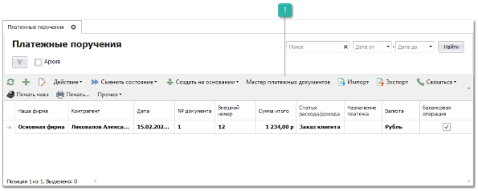

Пункт меню содержит список документов **Платежное поручение**. **Платежное поручение** — это распоряжение владельца счета (плательщика) обслуживающему его банку, оформленное расчетным документом, перевести определенную денежную сумму на счет получателя средств, открытый в этом или другом банке.

В программе **Платежные поручения** создаются в случае безналичной выплаты денежных средств. Если платеж не является "балансовым", он отображается в журнале документов курсивным начертанием и серым цветом шрифта.

Панель действий содержит стандартные команды и некоторые уникальные команды:

 **Мастер платежных документов**

Позволяет открыть мастер создания платежных документов.