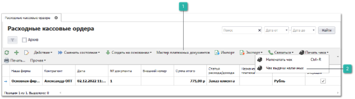

Пункт меню содержит список документов **Расходные кассовые ордера**, по которым производится выплата **Нашей фирмой** наличных средств**.**

Панель действий содержит стандартные команды и некоторые уникальные команды:

 **Мастер платежных документов**

Позволяет открыть мастер создания платежных документов.

 **Чек выдачи наличных**

Позволяет напечатать не фискальный чек с признаком "Выплата" наличных. 

::: info Примечание

Доступность данной команды определяется разрешением **Можно печатать чек выдачи наличных** в разделе **Управление** ► **Настройки программы** ► **Роли пользователей** ► **Разрешения для роли пользователей** группа **Справочники** ► **Торговое** **оборудование**.

:::