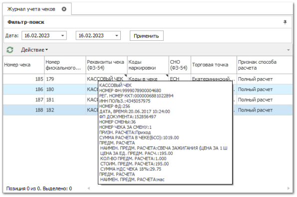
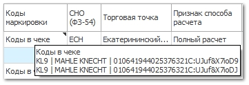

В **Журнале учета чеков** фиксируется запись по каждому напечатанному чеку в программе.

Фискальные данные чека будут отражены в колонках: Номер фискального документа (ФЗ-54) и Реквизиты чека (ФЗ-54).

При наведении курсором на **КАССОВЫЙ ЧЕК** во всплывающем окне будут отображены все его обязательные реквизиты.

Колонка **Торговая точка** отражает активную Торговую точку на момент печати чека.

Колонка **Коды маркировок** при наведении на **Коды в чек** отображает информацию о товаре (код и производитель) и переданных кодах маркировки.

