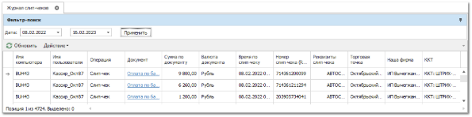

В **Журнале слип-чеков** фиксируется запись по каждому напечатанному слип-чеку, Слип-чек подтверждает проведение операций по банковской карте, совершенных при помощи эквайрингового терминала. Потребительский чек (слип) печатается в двух экземплярах (для покупателя и продавца).

Основным признаком слип-чека является **RRN (Reference Retrieval Number)** – уникальный идентификатор банковской транзакции, который назначается банком-эквайером при инициализации платежа.

Фискальные данные чека будут отражены в колонках: Номер cлип-чека (RRN) и Реквизиты слип-чека.

При наведении курсором на наименование терминала в колонке **Реквизиты слип-чека** во всплывающем окне будут отображены реквизиты слип-чека.

