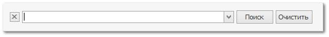

Для поиска текста в таблицах по всем колонкам можно воспользоваться встроенным поисковым элементом, вызываемым с помощью комбинации клавиш "Ctrl+F", либо вызова команды **Показать панель поиска** в контекстном меню заголовков колонок таблицы.

