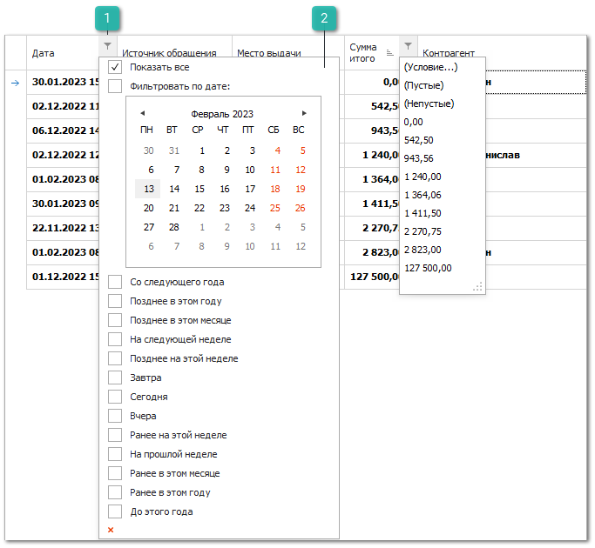
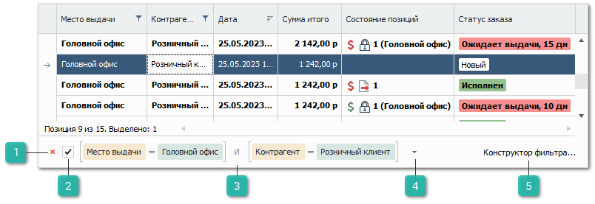
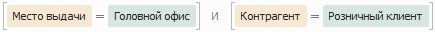
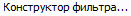
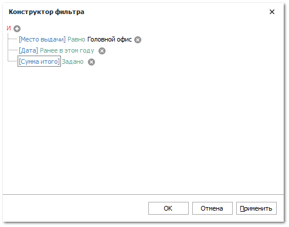

# Простая фильтрация в таблицах

В табличной части доступна настройка **Простой фильтрации**.

1. **Фильтры**

    

    Позволяет открыть условия фильтрации по колонке.

2. **Меню условий фильтрации**

    Позволяет выбрать из списка условия для выполнения фильтрации по колонке.

    ::: info Примечание

    Фильтры, выбранные в разных столбцах, накладываются друг на друга.

    :::

После применения фильтра внизу рабочей области появляется панель фильтров.

1. **Закрыть**

    

    Позволяет закрыть панель фильтров.

2. **Включить/Отключить**

    

    Позволяет активировать/деактивировать действия выбранного фильтра.

3. **Условие фильтрации**

    

    Отображает условие фильтрации выбранного фильтра.

4. **Список фильтров**

    

    Позволяет выбрать из выпадающего списка ранее созданные фильтры.

5. **Конструктор фильтра**

    

    Позволяет осуществить редактирование выбранного фильтра, путем добавления/удаления условия, а так же редактированием значений условия.

    