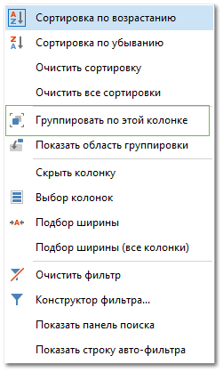
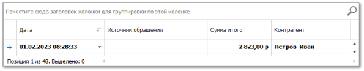
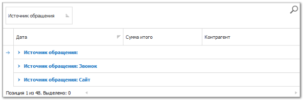
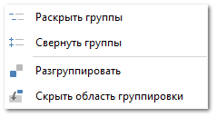

Для группировки значений в таблице необходимо вызвать на требуемом столбце контекстное меню правой кнопкой мыши и нажать **Группировать по этой колонке**. 

Либо перетащить заголовок столбца на область группировки, вызывается нажатием в контекстном меню на пункт **Показать область группировки**. 

Сгруппированные столбцы отражаются на панели **Область группировки**.

Разгруппировать список возможно через вызов пункта **Разгруппировать** контекстного меню на области группировки.

