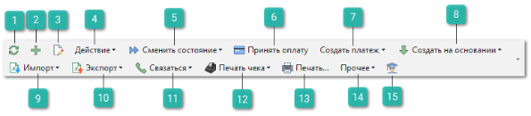
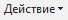
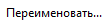
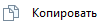
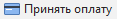
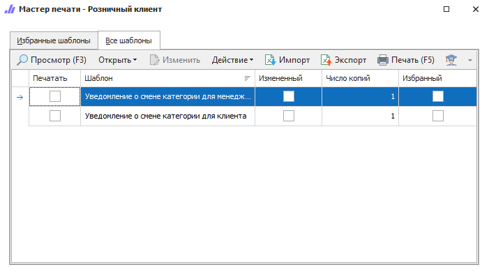
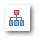

В данном разделе будут рассмотрены основные команды, которые присутствуют на панелях инструментов в различных разделах программы: справочниках, списках документов и т.п.

1. **Обновить**

    

    Позволяет обновить данные в таблице.

2. **Новый**

    

    Позволяет добавить новую запись в таблицу.

3. **Править**

    

    Позволяет открыть страницу редактирования выделенной записи.

4. **Действие**

    

    Позволяет выбрать команду действия из выпадающего списка команд:

     – команда **Удалить** позволяет пометить на удаление выделенные записи. При удалении запись перестает отображаться в табличной части, но из самой базы данных не удаляется, а только помечается на удаление. Для очистки базы данных от таких записей выполните команду **Удалить помеченные записи** в разделе меню **Управление ► Диагностика программы**.

    ::: info Примечание

    Просмотр записей помеченных на удаление доступно для пользователя при активной опции **Отображать удаленные элементы** и отключенной опции **Асинхронная загрузка в справочниках и документах** в разделе **Управление ► Настройки программы ► Пользователи ► Настройки пользователя**, вкладка **Разное**.

    :::

     – позволяет изменить отметку документа. Выбор отметок осуществляется из соответствующего справочника. Отметки позволяют отследить в каком статусе на данный момент находится документ;

    – команда для снятия отметки документа. Отметка присваивается с помощью команды **Изменить отметку**, выбор отметок осуществляется в соответствующем справочнике. Разрешения для снятия отгрузки настраивается в разделе **Управление** **► Настройки программы ► Настройки ►** группа **Склад и закупки ► Движение товара**.

     – команда **Переименовать** позволяет открыть выделенную запись для изменения поля **Наименования**;

    – команда **Копировать** позволяет скопировать выбранную запись.

5. **Сменить состояние**

    

    Позволяет выбрать действия из выпадающего списка команд:

    **Провести** – позволяет выполнить проведение документа

    **Отменить** – позволяет отменить проведение документа

    **Добавить в архив** – позволяет переместить документ в **Архив**. Документы **Заказ клиента** помещаются в архив, если в них нет позиций в состояниях, отличных от: **Отказ клиента**, **Расход**, **Возврат клиента** и **Заказ-наряд** (ЗН должен быть в статусе "Закрыт").

    **Извлечь из архива** – позволяет извлечь документ из **Архива**.

    ::: info Примечание

    Для некоторых документов в пункте **Сменить состояние** содержится перечень состояний документа: **Черновик**, **Отказ клиента**, **В очереди**, **В работе**, **Работы приостановлены**, **Закрыт**. При переводе документов в состояния **В очереди** или **В работе** выполняется проверка на заполнение обязательных полей в соответствии с настройкой **При переводе в очередь или в работу**.

    :::

6. **Принять оплату**

    

    Команда позволяет запустить интерфейс оплаты по выбранному документу для автоматического создания связанных платежных документов и печати чека. Кнопка доступна только для проведенных документов, имеющих задолженность.

7. **Создать платеж**

    

    Команда позволяет выбрать из выпадающего списка команду для создания разных типов платежей. Список команд зависит от типа документа, в котором вызывается команда.

8. **Создать на основании**

    

    Команда позволяет сформировать новый документы на основании выделенного. При создании документа на основании, в новый документ передаются только те позиции, которые находятся в подходящих состояниях.

9. **Импорт**

    

    Команда позволяет загрузить в таблицу (справочник, документы) новые записи из документа.

    ::: note Замечание

    Системой поддерживаются следующие форматы файлов для загрузки:Microsoft Excel 95-2003 (\*.xls);
    Microsoft Excel 2007-2013 (\*.xlsx, \*.xlsm);
    Файлы dBase (\*.dbf);
    Текстовые файлы с разделителями "точка с запятой", "запятая", "табуляция" (\*.txt, \*.csv).

    :::

10. **Экспорт**

    

    Команда позволяет экспортировать данные из таблицы в файл.

    Документы РН, ВК, ВП, ЗН, Перемещение товара, ПКО, РКО, ПН, ВБК, ОБК в выпадающем меню команды **Экспорт** содержат возможность выгрузки в 1С. 

    ::: note Замечание

    Системой поддерживаются следующие форматы выгружаемых файлов:Файлы \*.csv с разделителями "точка с запятой", "табуляция".
    Microsoft Excel 2007 (\*.xlsx);
    Таблица XML 2003 (\*.xml);
    MS Access (\*.mdb).

    :::

11. **Связаться**

    

    Команда позволяет связаться с контрагентом или сотрудником, выбрав команду для связи из выпадающего списка:

    – по нажатию на команду выполняется звонок выбранному контрагенту/сотруднику на номер, указанный в карточке этого **Контрагента**/ **Сотрудника**;

    ::: info Примечание

    Команда доступна для пользователей с подключенной IP-телефонией. Для подключения телефонии свяжитесь с менеджерами компании Tradesoft.

    :::

    **Отправить сообщение** – команда для отправки SMS-сообщения выбранному контрагенту на номер телефона, указанный в карточке. По нажатию на команду открывается форма для ввода текста сообщения;

    **Отправить** **email** – команда для отправки email выбранному контрагенту на почту, указанную в карточке. По нажатию на команду открывается форма для ввода текста сообщения;

    ::: note Замечание

    Для работы сервисов отправки сообщений по email и SMS необходимо активировать соответствующие разрешения в разделе Управление **► Настройки программы ► Настройки ►** группа **CRM ►Уведомления**.

    :::

    **Открыть чат** – команда позволяет открыть чат с клиентами, подписанными на Telegram-бота.

    ::: info Примечание

    Для работы сервиса отправки уведомлений и сообщений через Telegram-бот необходимо:▪ подключение дополнительной услуги. За подключением услуги обратитесь в отдел продаж Компании Tradesoft;▪ созданный и настроенный Telegram-бот;▪ установленный и подключенный **Сервер Parts.Intellect**.Подробнее о работе модуля читайте в [руководстве пользователя](https://product-doc.tradesoft.ru/ai/telegram/index.htm)

    :::

12. **Печать чека**

    

    Команда позволяет вызвать окно печати чека или окно выбора контрагента, для которого будет печататься чек.

13. **Печать...**

    

    Команда позволяет сформировать печатные бланки, доступные для конкретного раздела.

    ::: note Замечание

    Для документов: **Возвраты от клиентов**, **Приходные накладные** и **Возвраты поставщикам** доступна групповая печать документов.Для вывода печатных форм сразу по нескольким документам необходимо выбрать в списке несколько записей и нажать кнопку **Печать** на панели инструментов. А после этого в окне печати выбрать шаблон и необходимый режим в поле **Печатать**.Доступные значения
    
    - **Активный документ** – печать по документу, на котором установлен курсор мыши;

    - **Выделенные документы с группировкой по документам** – для каждого документа посылаются выбранные бланки по очереди;

    - **Выделенные документы с группировкой по шаблонам** – и очередь печати формируется с группировкой по бланкам, а не по документам.

    :::

    

14. **Прочее**

    

    Команда позволяет выбрать необходимое действие из выпадающего списка:

     **Добавить в корзину** – команда позволяет добавить выделенные позиции в **Корзину**.

     **Навигация по связям** – команда открывает панель с информацией по связанными документами для выделенного (в пункт **Прочее**).

     **Изображения** – команда позволяет увидеть добавленные в программу изображения по позиции.

    Обновить платежи – по нажатию на команду выполняется пересчет балансов клиентов;

    Обновить данные по документу – по нажатию на команду выполняется обновление данных по документу. 

15. **Помощь**

    

    Позволяет в отдельном окне открыть руководство пользователя. Руководство пользователя откроется на той странице описания разделов программы, с которого было открыто руководство. Например, из раздела **Приходные кассовые ордера** откроется страница с описанием этого раздела.

    В некоторых разделах программы доступен выпадающий список со следующими командами:

    **Посмотреть видеоурок** – позволяет открыть видео в браузере с обучением по выбранному разделу;

    **Открыть руководство пользователя** – позволяет открыть руководство пользователя.