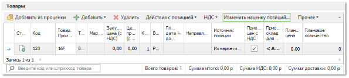
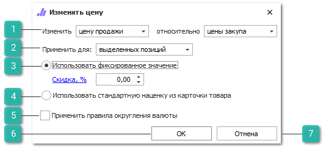

В данном разделе рассмотрены основные команды, которые присутствуют на панелях инструментов таблиц **Товары** и **Работы** документов:

Команды **Наценка/Скидка** и **Изменить наценку позиций...** позволяют изменить цену продажи/закупа у выделенных позиций товаров. Обе команды вызывают окно **Изменить цену**.

1. **Изменить относительно**

    

    Позволяет изменить цену продажи/цену закупа относительно цены закупа/цены продажи

2. **Применить для**

    

    Позволяет выбрать для каких товаров применить правило изменения цены. Возможны два состояния команды: **Выделенных позиций** и **Всех позиций**.

3. **Использовать фиксированное значение**

    

    Позволяет задать фиксированную наценку/скидку для выбранных товаров. Опцию **Наценка, %** можно сменить на опцию **Скидка, %** нажатием по ней левой кнопкой мыши.

4. **Использовать стандартную наценку из карточки товара**

    

    При активной настройке цены выбранных товаров изменяются относительно значений, указанных в карточке товара, в поле **Стандартная наценка, %**.

5. **Применить правила округления валюты**

    

    При включенной настройке применяются правила округления валюты, указанные в разделе **Финансы** ► **Валюты и курсы**, в инспекторе редактирования валюты, на вкладке **Округление цены**.

6. **Ок**

    

    Позволяет закрыть окно **Изменить цену** и применить указанные настройки изменения цены.

7. **Отмена**

    

    Позволяет закрыть окно **Изменить цену** без применения настроек.

::: info Примечание

Изменение цены с помощью команды **Наценка/Скидка** может быть не доступно пользователю, при отключенной настройке **Отображать команду "Наценка/Скидка"** в **Управление** **► Настройки пользователя ► Быстрая продажа**.

:::