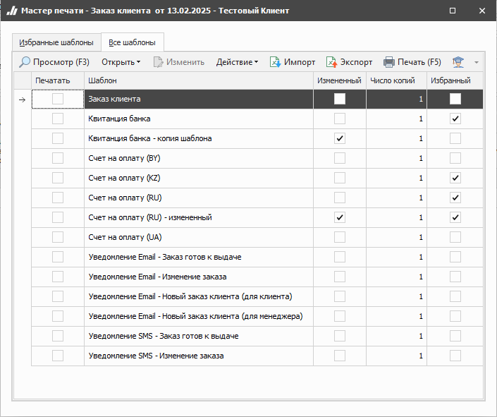
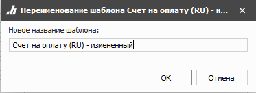
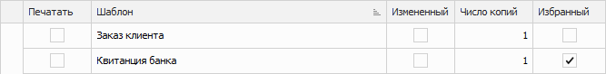
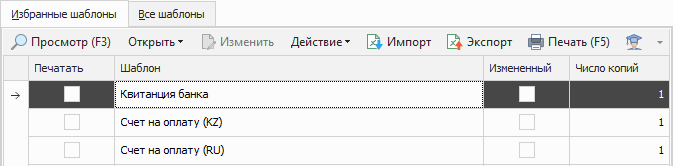

Программа позволяет выводить на печать различные документы. Для печати необходимо нажать кнопку **Печать** на панели управления.

## Панель действий

Панель состоит из следующих команд:

- **Просмотр (F3)** – позволяет открыть печатную форму для просмотра перед печатью;

- **Открыть** – позволяет открыть документ в выбранном формате. Содержит выпадающий список со следующими командами:

    - **В Word** – позволяет открыть документ в формате *.docx;

    - **В Excel** – позволяет открыть документ в формате *.xlsx;

    - **В PDF** – позволяет открыть документ в формате *.pdf;

- **Изменить** – позволяет открыть редактор шаблонов для внесения изменений;

::: note Замечание

Команда недоступна при редактировании стандартных шаблонов. Редактирование доступно только для шаблонов, которые были скопированы (команда **Действие ► Копировать**) или импортированы (команда **Импорт**).

:::

- **Действие** – содержит выпадающий список команд для взаимодействия с шаблоном:

    - **Удалить** – удаляет выбранный шаблон. Команда доступна при выборе только измененных шаблонов;

    - **Копировать** – копирует выбранный шаблон. При нажатии на команду производится открытие окна с вводом наименования нового шаблона;

    - **Переименовать** – позволяет открыть окно для изменения наименования шаблона. Команда доступна только для нестандартных шаблонов.

::: note Замечание

Сохранение шаблона недоступно, если:

- название содержит спец. символы `\`, `/`, `:`, `*`, `?`, `"`, `<`, `>`, `|`;

- название не указано;

- название и тип шаблона совпадают с уже имеющимся в базе данных.

:::

- **Импорт** – позволяет загрузить файл с шаблоном в расширении **\*.mrt**;

- **Экспорт** – позволяет выгрузить выделенный в табличной части шаблон, в файл с расширением **\*.mrt**;

- **Печать (F5)** – позволяет распечатать выбранные шаблоны;

- **Помощь** – позволяет открыть руководство пользователя на странице описания формы мастера печати.

::: info Примечание

При нажатии команд **Просмотр**, **Открыть**, **Изменить** и **Печать** осуществляется проверка документа:

- на признак, удален ли документ из базы данных. Для удаленных документов недоступна печать;

- на доступность печати по значению разрешения **Можно печатать** (раздел **Управление ► Настройки программы ► Роли пользователей**, группа **Документы**);

- на статус проводки – для непроведенных документов недоступна печать, если для документа отключено разрешение Можно печатать непроведенные (раздел **Управление ► Настройки программы ► Роли пользователей**, группа **Документы**).

:::

::: note Замечание

Команды: **Просмотр (F3)**, **Открыть**, **Печать (F5)** не доступны в **Мастере печати** вызываемом в разделе **Управление ► Торговое оборудование ► Справочник торгового оборудования**.

:::

## Табличная часть

Содержит список доступных для пользователя печатных шаблонов раздела.

Состоит из следующих колонок:

- **Печать** – позволяет выбрать необходимые для печати шаблоны;

- **Шаблон** – наименование шаблона из справочника **Печатные шаблоны**;

- **Измененный** – отображает признак внесенных изменений в шаблон. Признак указывается автоматически при копировании стандартного шаблона или загрузке шаблона ручным способом;

- **Число копий** – позволяет указать необходимое для печати количество копий документа;

- **Избранный** – позволяет добавить шаблон в список избранных, которые отображаются на вкладке **Избранные шаблоны**. Это позволяет отметить только используемые на практике бланки и работать с ними.

## Вкладка Избранные шаблоны

Отображает список печатных шаблонов, добавленных в избранное.

Состоит из следующих колонок:

- **Печать** – позволяет выбрать необходимые для печати шаблоны;

- **Шаблон** – наименование шаблона из справочника Печатные шаблоны;

- **Измененный**– отображает признак внесенных изменений в шаблон. Признак указывается автоматически при копировании стандартного шаблона или загрузке шаблона ручным способом;

- **Число копий** – позволяет указать необходимое для печати количество копий документа.