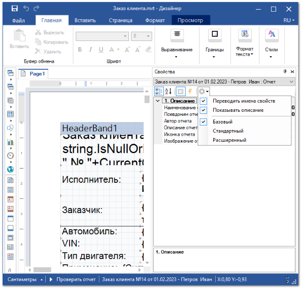
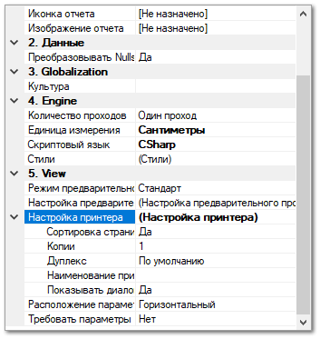

Для того, что бы печать конкретного шаблона уходила на заранее указанный принтер и без предварительного диалога на печать. Необходимо задать нужное устройство вывода в свойствах формы шаблона.

Для этого необходимо открыть выбранный шаблон в редакторе шаблонов, нажатием кнопки **Изменить**, в окне **Мастера настройки шаблонов**. В открывшемся **Редакторе шаблонов**, в правом боковом меню **Свойства**, необходимо выбрать уровень отображения свойств шаблона **Стандартный** или **Расширенный**.

::: info Примечание

Недоступно редактирование стандартных шаблонов. Редактирование доступно только для шаблонов, которые были скопированы (команда **Действие ► Копировать**) или импортированы (команда **Импорт**).

:::

Далее в открывшемся блоке свойств вносим необходимые данные в пункт **Настройки принтера** и сохраняем отредактированный шаблон.

