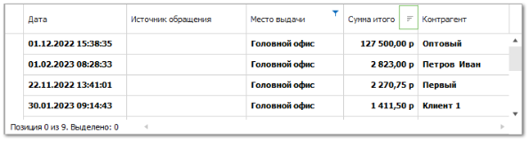

# Сортировка

Сортировка осуществляется нажатием на заголовок соответствующего столбца в таблице.

В программе предусмотрена возможность сортировки по нескольким столбцам. Для этого сортируется ведущий столбец, а затем через клавишу "Shift" сортируются остальные столбцы. Если в ведущем столбце встречаются одинаковые позиции, то в следующем (участвующем в сортировке) столбце позиции выстроятся согласно направлению их сортировки.

Сортировка осуществляется по возрастанию/убыванию исчисляемых значений, или по прямому/обратному алфавитному порядку для неисчисляемых значений.