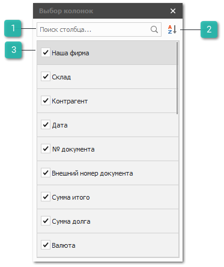
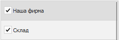

# Управление колонками в таблицах

Практически во всех таблицах программы доступна возможность управления колонками.

Для того, чтобы изменить порядок следования колонок выполните следующие действия:

` `**»**  Кликните левой кнопки мыши заголовок колонки и удерживая левую кнопку мыши перетащите колонку в требуемое место среди остальных колонок.

Для изменения ширины колонки выполните следующие действия:

` `**»**  Кликните левой кнопки мыши по левому или правому краю заголовка колонки и  удерживая левую кнопку мыши перетащите край влево/вправо. 

::: note Замечание

Для автоматического выравнивания ширины колонки можно воспользоваться командами контекстного меню у заголовка колонки: **Подбор ширины** или **Подбор ширины (все колонки).**

:::

Для того, чтобы скрыть неактуальную колонку из списка видимых выполните следующие действия:

` `**»** Кликните левой кнопки мыши по заголовку и удерживая левую кнопку мыши перетащите в любую область экрана, пока не появится иконка .

Для того, чтобы отобразить скрытую колонку выполните следующие действия: 

` `**»** Кликните правой кнопкой мыши на заголовке любой колонки. 

` `**»** В открывшемся контекстном меню нажмите команду **Выбор колонок**.

1. **Поиск столбца**

    

    Позволяет произвести поиск по названиям колонок.

2. **Сортировка**

    

    Позволяет включить/выключить сортировку по алфавиту.

3. **Список колонок**

    

    Содержит список всех колонок, доступных в разделе. Поле  позволяет включить/выключить отображение колонки.