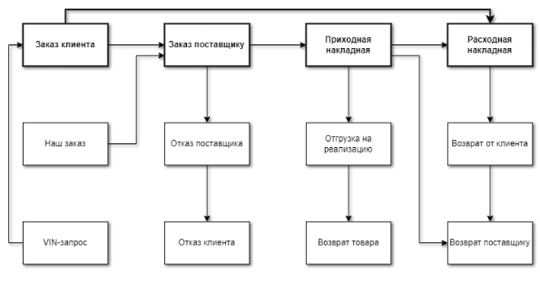

# Взаимосвязи документов в программе

Все операции в программе фиксируется через создание и проведение документов. Связи между документами осуществляются через их позиции. После проведения документа позициям присваиваются состояния, например, после создания и проведения документа **Заказ клиента,** позиции по документу приобретают состояние **Заказ клиента** (если товар отсутствует в наличии). Как только на основании документа **Заказ клиента** будет, например, создан и проведен документ **Заказ поставщику,** позиции, которые были заказаны у поставщика, сменять состояние на **Заказ поставщику**.

Основная последовательность оформления документов.

На рисунке ниже представлен типовой порядок оформления документов. Для продаж можно выделить два ключевых направления:

::: info Примечание

На основании документа **Заказ клиента** также может быть создан документ **Заказ-наряд** при условии, что позиции заказа клиента находятся в состоянии **Заказ клиента** или **Заказ поставщику**.

:::

Реализация товара из наличия – только документ **Расходная накладная**;

Реализация товара под заказ – **Заказ клиента** – **Заказ поставщику** – **Приходная накладная** – **Расходная накладная**.

В таблице ниже показаны возможные товарные транзакции в документах. Символ "+" на пересечении двух документов означает, что на основании документа из строки можно создать документ из столбца.

||Заказ клиента|Отказ клиента|Заказ поставщику|Отказ поставщика|Приходная накладная|Резервирование|Отмена резерва|Отгрузка на реализацию|Возврат товара на склад|Расходная накладная|Возврат от клиента|Возврат поставщику|
| :- | :-: | :-: | :-: | :-: | :-: | :-: | :-: | :-: | :-: | :-: | :-: | :-: |
|VIN-запрос|**+**||||||||||||
|Заказ клиента||**+**|**+**|||**+**||||**+**|||
|Наш заказ|||**+**||||||||||
|Заказ поставщику||**+**||**+**|**+**||||||||
|Отказ поставщика||**+**|**+**||**+**||||||||
|Приходная накладная||**+**||||**+**||**+**||**+**||**+**|
|Резервирование|||||||**+**||||||
|Отмена резерва||**+**||||**+**||||**+**|||
|Отгрузка на реализацию|||||||||**+**|**+**|||
|Возврат товара на склад (перемещение)|||||||||||**+**||
|Расходная накладная|||||||||||||
|Возврат от клиента||||||||||||**+**|

В программе запрещено создавать документы на основании непроведенных за исключением:

- создания документов из Мастеров;

- создания **Заказа клиента** на основании **Заказ-наряда**;

- создания **Задания на отгрузку** товара на основании **Расходной накладной** и **Задания на отгрузку товара**;

- создания **Задания на разбор** товара на основании **Приходной накладной** и **Задания на разбор товара**.