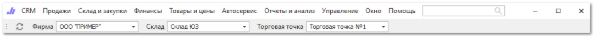

# Главное меню

**Главное меню** позволяет получить доступ к основным элементам в программе.

В строках некоторых пунктов указаны значения горячих клавиш, с помощью которых можно быстро вызвать функции программы без обращения к главному меню.

Краткое описание основных элементов главного меню:

**CRM** – раздел содержит инструменты, справочники и документы, предназначенные для взаимодействия с клиентами;

**Продажи** – раздел содержит инструменты, справочники и документы для осуществления продаж в программе;

**Склад и закупки –** раздел содержит инструменты, справочники и документы для работы с собственным наличием на складах и торговых точках, а также для работы с поставщиками в программе;

**Финансы –** содержит инструменты, справочники и документы для работы с финансовыми операциями в программе;

**Товары и цены –** раздел содержит прайс-листы, данные о номенклатуре и различные инструменты для управления ценовой политикой в программе;

**Автосервис** – доступ к справочникам и функциям модуля **Автосервис** программы **Parts.Intellect**;

**Отчеты и анализ** – доступ к отчетам в программе;

**Окно –** быстрый доступ к открытым в программе вкладкам. Рабочий окна в пункте меню будут выстроены по порядку. Дополнительной функцией является команда **Закрыть все окна**, что позволяет моментально закрыть сразу все открытые вкладки;

**Помощь** – справочная информация о программе;

**Поиск** – поиск по главному меню программы;

::: note Замечание

Поиск начинает работать при вводе 2-х символов.Поиск пунктов меню также осуществляется по ошибочно введенному наименованию в английской раскладке.

:::

Кнопка **Обновить** – элемент обновляет список **Наших фирм** и **Складов**, для отображения в соответствующих выпадающих списках на панели главного меню;

**Фирма** – устанавливается наша фирма, которая будет подставляется в документы по умолчанию;

**Склад** – выбираются активные склады для отображения остатков и работы с документами;

**Торговая точка** – выбирается активная торговая точка пользователя.

Помимо главного меню, в программе существует множество контекстных меню, вызов которых осуществляется нажатием правой кнопки мыши. Содержание контекстного меню зависит от рабочей вкладки и элемента, для которых оно вызвано.