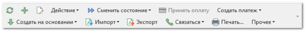
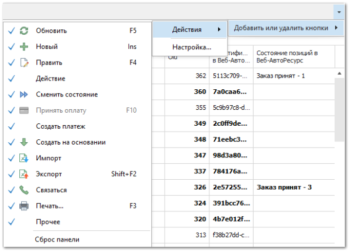
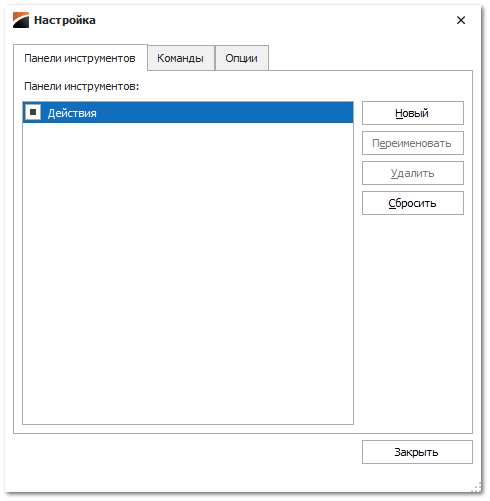
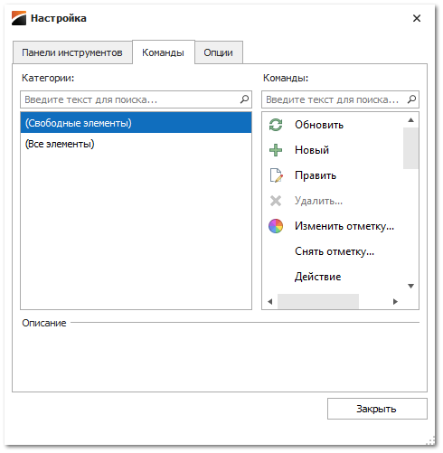
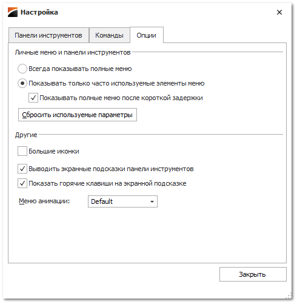

# Настройка панелей инструментов

Панели инструментов расположены на каждой форме и предоставляют пользователю быстрый доступ к действиям и функциям программы. Для удобства использования программы панели инструментов доступны для индивидуальной настройки каждому пользователю. Любой пользователь базы данных может определить свой набор действий и функций на панелях инструментов программы.

Рассмотрим основные возможности по управлению панелями инструментов в программе.

**Панель инструментов** может содержать управляющие элементы, позволяющие выполнять какие-либо действия над записями, кнопки быстрого вызова функций или разделов программы.

В программе существует возможность настраивать панели управления. Для того, чтобы добавить или убрать какие-либо элементы на текущей панели управления, выполните следующие действия:

**»** Нажмите на кнопку в виде стрелки  в правой части панели.

**»** В выпадающем меню выберите команду **Добавить или удалить кнопки**.

**»** Выберите пункт **Действия**. Откроется список действия доступных для работы в данной таблице. Для того, чтобы скрыть или добавить действие на панель, снимите или установите галочку напротив нужного действия.

**»** Чтобы вернуть панель в исходное состояние (на панели будут отображаться все доступные элементы), выберите пункт **Сброс панели**.

При выборе пункта **Настройка** в выпадающем меню панели управления, открывается окно для настройки текущей или добавления новой панели управления.

Вкладка **Панели инструментов** содержит список уже имеющихся панелей управления. Для создания новой панели управления нажмите кнопку **Новый.** Галка напротив названия панели управления позволяет скрыть **Панель инструментов** без ее удаления.

Вкладка **Команды** служит для добавления новых элементов на **Панель инструментов**. Для того, чтобы добавить управляющий элемент на панель, необходимо, удерживая его левой кнопкой мыши, перетащить с вкладки **Команды** в нужное место на панели управления. Для удаления элемента с панели, можно перетащить его обратно на вкладку **Команды**.

Вкладка **Опции** позволяет установить более гибкие настройки для панели управления.

На вкладке можно установить следующие настройки:

- **Всегда показывать полное меню** или **Показывать только часто используемые элементы меню**. Для опции **Показывать только часто используемые элементы меню** доступен пункт **Показывать все меню после короткой задержки**;

- **Большие иконки –** позволяет отобразить иконки большего размера на панели управления;

- **Выводить экранные подсказки панели инструментов –** позволяет отображать всплывающие окна при наведении на кнопку в панели управления, с более подробной информацией;

- **Показывать горячие клавиши на экранной подсказке** – при активной опции **Выводить экранные подсказки панели инструментов** в всплывающих окнах с подсказками будут так же отображаться сочетания горячих клавиш для быстрого выполнения действия;

- **Меню анимации** – позволяет выбрать вид анимации для открытия выпадающих меню.

::: info Примечание

Если по ошибке была скрыта единственная панель действий, то для возврата ее на свое место нужно вызвать меню настройки панели управления с помощью комбинации клавиш *Alt+F11* и вернуть галку напротив необходимой панели.

:::