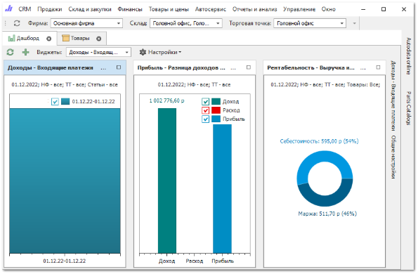

Вид **Рабочего окна** программы Parts.Intellect зависит от уровня прав доступа пользователя. Максимальным уровнем доступа обладает администратор программы.

Рассмотрим состав **Рабочего окна** программы на примере пользователя с правами администратора. 

**Рабочее окно** приложения включает:

**Главное меню программы** – содержит доступ к разделам и подразделам программы, разрешенным для данного пользователя;

**Нижнее меню программы** – содержит гиперссылки для быстрого перехода к отдельным блокам программы, панель поиска информации в базе по заданным параметрам, а также кнопки для получения информации о состоянии работоспособности отдельных сервисов;

**Начальная страница** – начальная страница, которая отображается при запуске программы. Пользователям открывается начальная страница, выбранная в настройке **Главная страница** в разделе **Управление** **► Настройки программы**, вкладка **Пользователи ► Настройки пользователя ► Основные**. По умолчанию для всех пользователей открывается страница **Дашборд**;

**AutoData Online** – панель доступа к сервису AutoData Online;

**Parts Catalogs** – панель доступа к сервису Parts Catalogs.