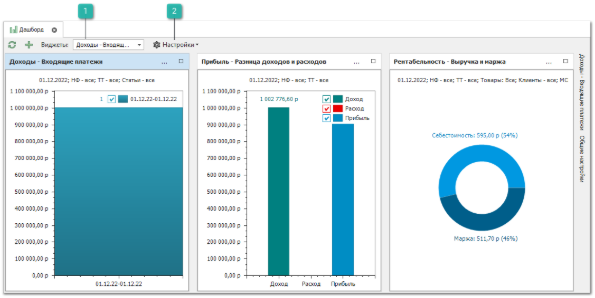
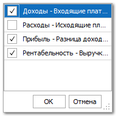
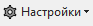
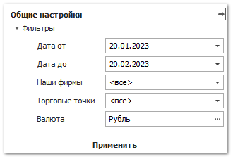

На странице представлены статистические данные в виде диаграмм (виджетов), с возможностью просмотра одновременно сразу нескольких  показателей и их настройкой по основным критериям. Страница **Дашборд** по умолчанию является начальной страницей при открытии программы Parts.Intellect.

::: info Примечание

Изменить начальную страницу программы можно в разделе **Управление** **► Настройки программы**, вкладка **Пользователи ► Настройки пользователя ► Основные**, настройка **Главная страница**.

:::

Панель действий содержит стандартные команды и некоторые уникальные команды:

 **Виджеты**

Позволяет выбрать из выпадающего списка необходимые для отображения виджеты.

 **Настройки**

При вызове команды **Настройки** доступны новые пункты:

- **Открыть общие настройки** – позволяет открыть окно **Общие настройки**, в котором задаются параметры для отображения отчетов в виджетах: **Период отчет**, **Наши фирмы**, **Торговые точки**, **Валюта**;

- **Упорядочить виджеты** – позволяет автоматический упорядочить виджеты в разделе в наиболее оптимальном виде;

- **Сбросить настройки виджетов** – позволяет сбросить фильтры, настройки графиков и даты для всех виджетов до значений по умолчанию.

