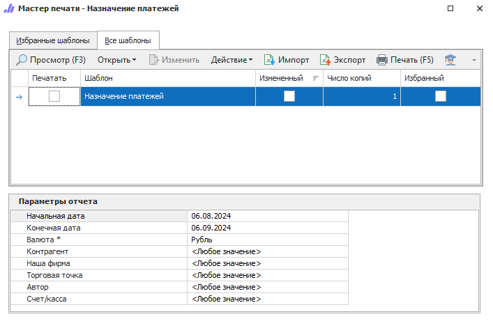

Отчет отражает разнесение документов и текущие остатки (долги) по ним. В отчете можно увидеть разнесение платежных документов (**ПП**, **ППвх**, **ПКО**, **РКО**), накладных (**ПН**, **РН**), **Заказ-нарядов** и возвратов (**ВК**, **ВП**), в том числе взаимозачеты. Позволяет контролировать, какие платежи за указанный период закрывают/не закрывают долг по различным документам и отслеживать, какой не разнесенный остаток от платежа можно использовать для закрытия долгов по контрагентам. Данные упорядочены по дате разноски.

::: details Читайте также

- [Общие принципы формирования отчетов](../obshchie_printsipy_formirovaniya_otchetov.md)

- [Создание отчета Назначение платежей](../../../work/otchety/finansovye_otchety/naznachenie_platezhej.md)

:::