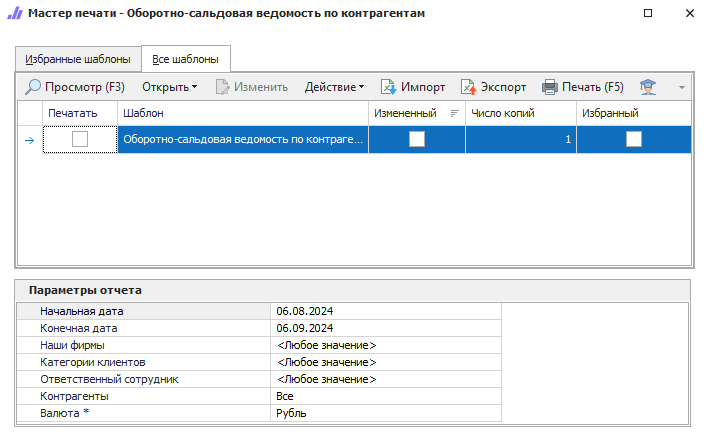

Отчет отражает сальдо на начало и конец выбранного периода, а также обороты за этот период для каждого контрагента.

::: details Читайте также

- [Общие принципы формирования отчетов](../obshchie_printsipy_formirovaniya_otchetov.md)

- [Создание отчета Оборотно-сальдовя ведомость по контрагентам](../../../work/otchety/finansovye_otchety/osv_po_kontragentam.md)

:::