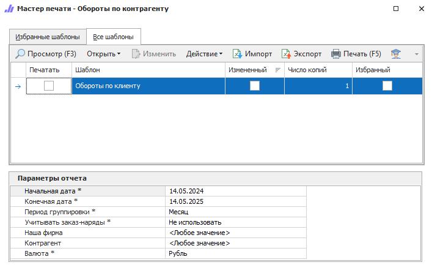

Отчет позволяет оценить обороты по контрагенту: сумму покупок, оплат и возвратов. По умолчанию отчет строится за последний год с помесячной группировкой показателей.

::: details Читайте также

[Общие принципы формирования отчетов](../obshchie_printsipy_formirovaniya_otchetov.md)

[Создание отчета Обороты по контрагенту](../../../work/otchety/finansovye_otchety/oboroty_po_kontragentu.md)

:::