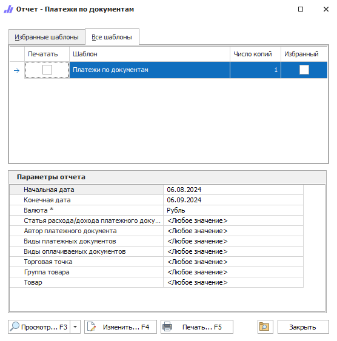

Отчет выводит список позиций из проведенных документов **Расходная накладная**, которые были хотя бы частично оплачены.

::: details Читайте также

- [Общие принципы формирования отчетов](../obshchie_printsipy_formirovaniya_otchetov.md)

- [Создание отчета Платежи по документам](../../../work/otchety/finansovye_otchety/platezhi_po_dokumentam.md)

:::