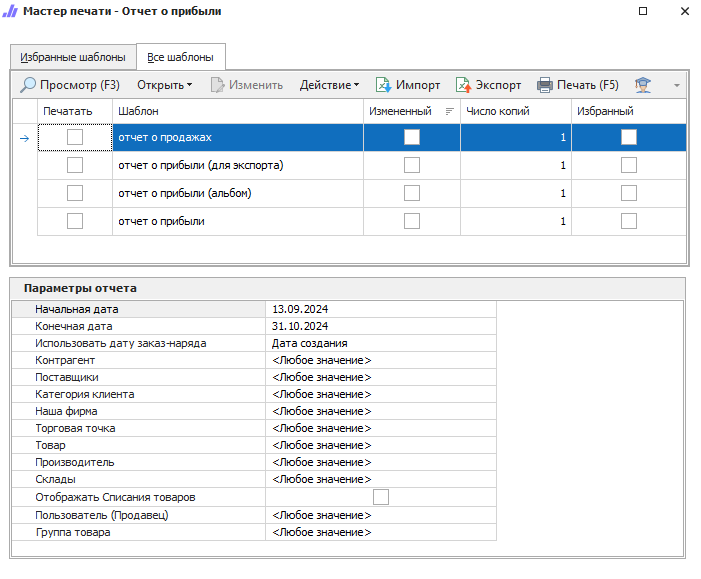
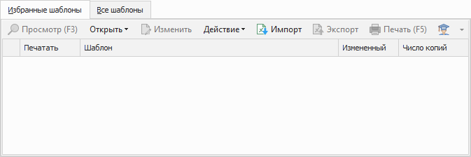
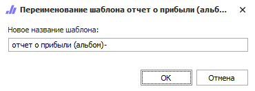
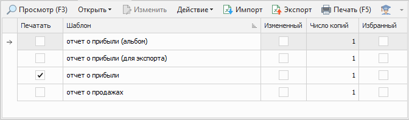
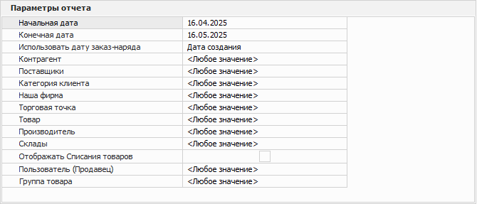

Пункт меню **Отчеты и анализ** содержит группы отчетов, каждая из групп включает в себя перечень отчетов с множеством шаблонов для выбора.

Перед печатью или просмотром отчета необходимо задать его параметры, в зависимости от которых в отчет попадают данные для отображения.

Мастер печати содержит элементы:

- [вкладка **Избранные шаблоны**](#избранные-шаблоны);

- [панель действий](#панель-действий);

- [табличная часть](#табличная-часть);

- [блок **Параметры отчета**](#параметры-отчета).

## Избранные шаблоны

Отображает список печатных шаблонов добавленных в избранное.

Состоит из следующих колонок:

- **Печать** – позволяет выбрать необходимые для печати шаблоны;

- **Шаблон** – наименование шаблона из справочника **Печатные шаблоны**;

- **Измененный** – отображает признак внесенных изменений в шаблон. Признак указывается автоматически при копировании стандартного шаблона или загрузке шаблона ручным способом;

- **Число копий** – позволяет указать необходимое для печати количество копий документа.

## Панель действий

Панель состоит из следующих команд:

- **Просмотр (F3)** – позволяет открыть печатную форму для просмотра перед печатью;

- **Открыть** – позволяет открыть документ в выбранном формате. Содержит выпадающий список со следующими командами:

    - **В Word** – позволяет открыть документ в формате **\*.docx**;
    - **В Excel** – позволяет открыть документ в формате **\*.xlsx**;
    - **В PDF** – позволяет открыть документ в формате **\*.pdf**;

- **Изменить** – позволяет открыть редактор шаблонов для внесения изменений;

::: note 

Команда недоступна при редактировании стандартных шаблонов. Редактирование доступно только для шаблонов, которые были скопированы (команда **Действие ► Копировать**) или импортированы (команда **Импорт**).

:::

- **Действие** – содержит выпадающий список команд для взаимодействия с шаблоном:

    - **Удалить** – удаляет выбранный шаблон. Команда доступна при выборе только измененных шаблонов;
    - **Копировать** – копирует выбранный шаблон. При нажатии на команду производится открытие окна с вводом наименования нового шаблона;
    - **Переименовать** – позволяет открыть окно для изменения наименования шаблона. Команда доступна только для шаблонов, которые не являются стандартными.

::: note Замечание

Сохранение шаблона недоступно, если:

- название содержит спец. символы `\`, `/`, `:`, `*`, `?`, `"`, `<`, `>`, `|`;

- название не указано;

- название и тип шаблона совпадают с уже имеющимся в базе данных.

:::

- **Импорт** – позволяет загрузить файл с шаблоном в расширении **\*.mrt**;

- **Экспорт** – позволяет выгрузить выделенный в табличной части шаблон, в файл с расширением **\*.mrt**;

- **Печать (F5)** – позволяет распечатать выбранные шаблоны;

- **Помощь** – позволяет открыть руководство пользователя на странице описания формы мастера печати.

## Табличная часть

Содержит список доступных для пользователя печатных шаблонов раздела.

Состоит из следующих колонок:

- **Печать** – позволяет выбрать необходимые для печати шаблоны;

- **Шаблон** – наименование шаблона из справочника **Печатные шаблоны**;

- **Измененный** – отображает признак внесенных изменений в шаблон. Признак указывается автоматически при копировании стандартного шаблона или загрузке шаблона ручным способом;

- **Число копий** – позволяет указать необходимое для печати количество копий документа;

- **Избранный** – позволяет добавить шаблон в список избранных, которые отображаются на вкладке **Избранные шаблоны**. Что позволяет отметить только используемые на практике бланки и работать с ними.

## Параметры отчета

Вкладка содержит параметры, в зависимости от которых отбираются данные в отчеты.

::: info Примечание

Обязательные параметры отмечены значком – `*`.

:::

Для всех отчетов идентичными являются свойства **Начальная/конечная дата**, далее, в зависимости от вида отчета, необходимо заполнять свойственные для него параметры, которые будут действовать на все шаблоны в группе отчетов. Данные в отчет отбираются согласно заданным параметрам.

После выставления параметров отчет доступен для печати и просмотра.